# Design Document

## Overview

Este documento descreve o design técnico do **Ritmo**, aplicativo Android pessoal, local-first, offline e privado, derivado estritamente de `requirements.md`. Nenhuma feature além das especificadas é introduzida; onde os requisitos não fixam um valor, o texto marca a lacuna como **Decisão de design** com justificativa e rastreio.

### Objetivo do design

Traduzir as nove regras de negócio (RN-01 a RN-09) em uma arquitetura em três camadas na qual **todo julgamento temporal é centralizado**, **todo estado diário é uma máquina de estados explícita** e **todo recálculo é determinístico, idempotente e não destrutivo**.

### Stack

| Preocupação | Escolha | Justificativa |
|---|---|---|
| App | Flutter (Android primeiro) | RNF-01.3 |
| Persistência | `drift` sobre SQLite, com `sqlite3_flutter_libs` | tipagem forte, migrações versionadas, transações; a biblioteca nativa embarcada garante SQLite ≥ 3.8 para o índice único parcial exigido em RD-11 ([drift migrations](https://drift.simonbinder.eu/migrations/)) |
| Estado / injeção | `riverpod` (+ `riverpod_generator`) | grafo de dependências explícito, invalidação reativa das leituras derivadas |
| Tempo | `timezone` (base de dados IANA embarcada) | fuso de negócio fixo, independente do aparelho (RF-05.1, RNF-04.2) |
| Notificações | `flutter_local_notifications` + `zonedSchedule` com `TZDateTime` | agendamento no fuso oficial (RF-08, RNF-04.7-04.9) |
| Áudio (briefing MP3) | `just_audio` sobre arquivo local | RF-01.4, RF-01.6 |
| Markdown | `flutter_markdown` com HTML bruto desabilitado | RF-09.6, RNF-02.5 |
| Navegação | `go_router` com shell de cinco destinos | navegação declarativa, deep link do protocolo e da revisão |
| Testes de propriedade | `glados` | PBT em Dart puro para o domínio |

### Princípios de design que decorrem dos requisitos

1. **Um único relógio de negócio.** Nenhuma camada chama `DateTime.now()`. Todo instante vem de `OperationalClock`, sempre em `America/Sao_Paulo` (RF-05.1, RNF-04.1, RNF-04.2).
2. **Lifecycle separado de resultado.** `closed_at` (lifecycle) nunca é inferido de `sealed|unsealed|mute` e vice-versa (RF-05.6, RD-3).
3. **Nada é apagado.** Feriados, dispensas revogadas e protocolos invalidados permanecem auditáveis (RF-02.25, RF-03.20, RF-05.18).
4. **Derivar em vez de armazenar.** Taxa, sequências, "aguardando encerramento" e ordem semanal são **funções puras** sobre o estado persistido; só há persistência quando o requisito exige estabilidade (protocolo, sugestão semanal).
5. **Zero gamificação.** Não existe entidade, campo, cor ou copy de streak, ponto, recorde ou punição (RF-02.19, RA-01.8, Restrição 6.1).
6. **Copies literais são constantes.** Toda copy declarada literal vive em `lib/core/copy.dart` e é verificada por teste (RNF-03.4).

---

## Architecture

### Camadas

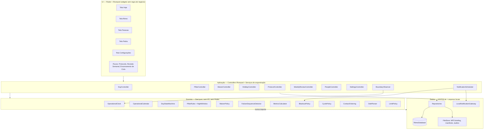

**Regras de dependência.** `domain` não importa `flutter`, `drift` nem `dart:io`; recebe tempo por `OperationalClock` e dados por estruturas imutáveis. Isso torna todo o núcleo de regras testável por propriedades sem emulador (base da estratégia de testes).

### Fluxo de leitura da tela Hoje

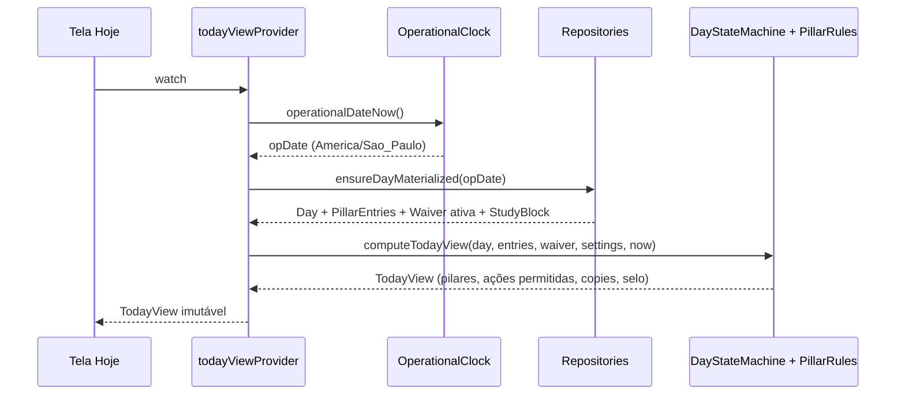

`ensureDayMaterialized` é a única porta que cria `Day`, sempre em transação, com classificação inicial (`mute` para sábado/domingo/feriado ativo, `unsealed` para dia útil) e nunca para datas anteriores a `activation_date` (RF-05.7).

### Estrutura de pastas

```
lib/
  core/            copy.dart, result.dart, limits.dart, ids.dart
  domain/
    time/          operational_clock.dart, operational_calendar.dart, night_window.dart
    day/           day_state_machine.dart, pillar_rules.dart, waiver_policy.dart
    protocol/      failure_sequence_detector.dart, protocol_reconciler.dart
    metrics/       metrics_calculator.dart
    holidays/      holiday_recalculation.dart
    notifications/ blackout_policy.dart, notification_plan.dart
    cycles/        cycle_policy.dart
    people/        contact_ordering.dart
    review/        review_policy.dart
    manifest/      oath_parser.dart
  data/
    db/            database.dart, tables/*.dart, daos/*.dart, migrations/
    repositories/  *_repository.dart
    files/         file_store.dart, audio_gateway.dart
    notifications/ local_notification_gateway.dart
  app/             providers, controllers, boundary_observer.dart, scheduler.dart
  ui/              screens/, flows/, widgets/
assets/manifesto/manifesto.md
assets/audio/briefing.mp3
```

---

## Components and Interfaces

### 1. Serviço de tempo operacional

Responsável por **toda** decisão de data e hora de negócio (RF-05.1, RNF-04.1).

```dart
/// Fuso de negócio imutável. Nunca substituído pelo fuso do aparelho.
const String kBusinessTimeZone = 'America/Sao_Paulo';

/// Hora local sem data, comparável na linha temporal operacional.
class LocalTimeOfDay { final int hour, minute; }

class OperationalDate implements Comparable<OperationalDate> {
  final int year, month, day;           // data civil que nomeia o dia operacional
  bool get isWeekend;                   // sábado ou domingo
}

abstract class OperationalClock {
  /// Instante corrente já convertido para o fuso oficial.
  TZDateTime nowInBusinessZone();

  /// Data operacional vigente (RF-05.4, RF-05.9).
  OperationalDate operationalDateNow();

  /// Data operacional de um instante arbitrário.
  OperationalDate operationalDateOf(TZDateTime instant);

  /// Instante de abertura da data operacional [d] = civil d @ day_close_time.
  TZDateTime operationalOpen(OperationalDate d);

  /// Instante de fechamento = operationalOpen(d + 1 dia) (RF-05.5).
  TZDateTime operationalClose(OperationalDate d);

  /// Instante de night_end_time dentro da janela de [d] (RF-01.12).
  TZDateTime blockDeadline(OperationalDate d);

  /// Verdadeiro quando o fuso do aparelho difere do oficial (RF-05.2).
  bool get deviceZoneDiverges;
}
```

**Definições formais** (implementadas em `OperationalCalendar`, funções puras):

- `civilTime(t)` = hora local de `t` no fuso oficial.
- `operationalDateOf(t)` = `civilDate(t) - 1 dia` se `civilTime(t) < day_close_time`; senão `civilDate(t)` (RF-05.4).
- `operationalOpen(d)` = instante civil `d @ day_close_time`.
- `operationalClose(d)` = `operationalOpen(d + 1)`, o instante que preenche `closed_at` de `d` e abre `d + 1` (RF-05.5).
- **Deslocamento operacional** de uma hora civil `h`: `offset(h) = (h - day_close_time) mod 24h`. É a coordenada de `h` dentro da janela `[operationalOpen(d), operationalClose(d))`, e por isso permite comparar `night_end_time` com `day_close_time` mesmo quando ambos cruzam a meia-noite civil (Glossário, RA-01.1).
- `blockDeadline(d)` = `operationalOpen(d) + offset(night_end_time)`. Consequência direta: `blockDeadline(d) <= operationalClose(d)` para qualquer configuração válida.

Exemplo canônico com `day_close_time = 03:00` e `night_end_time = 01:30`: `offset(01:30) = 22h30`, logo `blockDeadline(sexta) = sábado 01:30`, e `operationalClose(sexta) = sábado 03:00` — a janela "só Recuperação" de RF-01.17 é `[sábado 01:30, sábado 03:00)`.

**Validação de configuração** (`SettingsValidator`, RA-01.1, RF-05.3):
`day_close_time ∈ [00:00, 04:00]`, padrão `03:00`; `night_end_time` válido quando `0 < offset(night_end_time) <= 24h`, o que reproduz `night_end_time <= day_close_time` na linha operacional.

> **Decisão de design (lacuna nos requisitos).** Os requisitos fixam o padrão de `day_close_time` (03:00) mas não o de `night_end_time`. O seed inicializa `night_end_time = day_close_time` (deslocamento 24h, o único valor derivável sem inventar política: Estudo permitido até o fechamento). Nessa configuração a janela de RF-01.17 é vazia e a copy correspondente não aparece — comportamento consistente, não um bypass. Alterar esse padrão exige decisão explícita de produto (Restrição 6.3).

**Mudança de `day_close_time`** (RF-05.23): a alteração é gravada em `Settings` e passa a valer apenas para fronteiras ainda não encerradas. Dias com `closed_at` preenchido nunca são reabertos, renomeados ou duplicados; a materialização usa o `day_close_time` vigente no momento da fronteira, e `Day.operational_date` é imutável.

**Horário de verão.** `America/Sao_Paulo` não observa DST atualmente, mas a base IANA contém regras históricas. Todo cálculo usa `TZDateTime` e normalização da biblioteca `timezone`; horas civis inexistentes são deslocadas para frente e horas ambíguas resolvem para a primeira ocorrência, de modo que exista exatamente um `closed_at` lógico por dia (RNF-04.3, RNF-04.4).

#### 1.1 Observador de fronteira em foreground

```dart
class BoundaryObserver with WidgetsBindingObserver {
  Future<void> start();          // agenda timer até operationalClose(opDateAtual)
  Future<void> onResumed();      // reconcilia fronteiras perdidas
  Stream<BoundaryEvent> events;
}

class BoundaryCrossingService {
  /// Executa em UMA transação: snapshot/autosave do editor ativo na data
  /// original, fechamento do dia, fechamento de blocos órfãos, reconciliação
  /// de protocolos e reagendamento de notificações.
  Future<BoundaryResult> crossBoundary(OperationalDate closing);
}
```

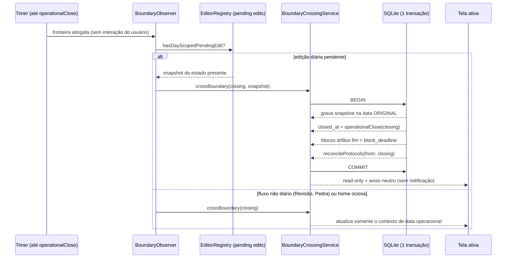

Garantias: um único fechamento lógico por dia mesmo sem interação (RNF-04.11); snapshot, autosave e fechamento na mesma transação (RF-05.31, RNF-04.12); nenhuma escrita posterior no dia encerrado e nenhuma reatribuição de dados para a nova data (RF-05.32, RD-38); fluxos não diários não são interrompidos (RF-05.33, RNF-04.13); o fechamento em foreground não emite notificação (RF-05.34).

Quando o app estiver fechado durante uma ou mais fronteiras, `onResumed`/`start` materializa **todas** as datas pendentes em ordem crescente, idempotentemente (`closed_at` só é escrito se nulo), o que satisfaz RNF-04.4 e RNF-04.5.

### 2. Máquina de estados do Day

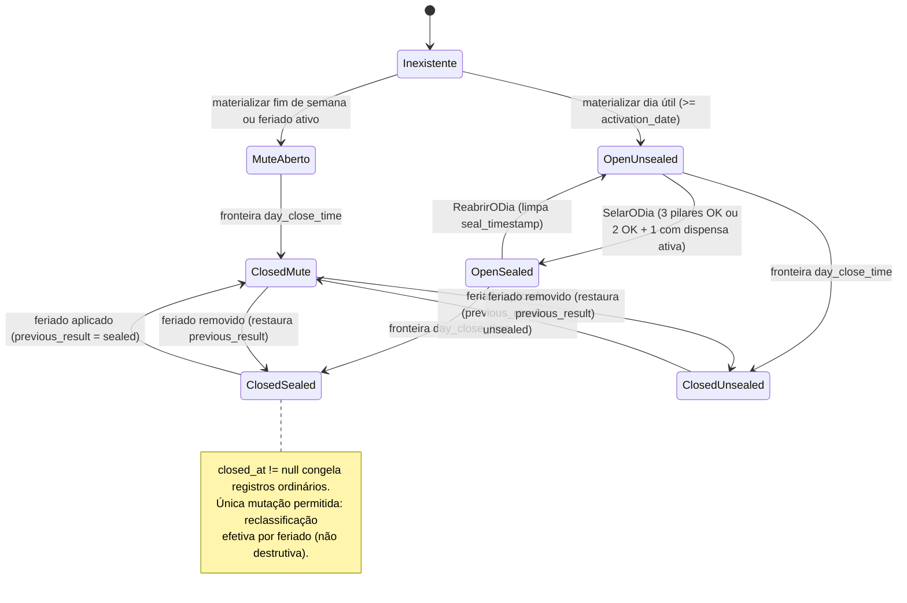

```dart
enum DayResult { sealed, unsealed, mute }
enum MuteCause { weekend, holiday }

class Day {
  final OperationalDate operationalDate;   // única (RD-2)
  final DayResult baseResult;              // sealed|unsealed, ignorando mute
  final DayResult effectiveResult;         // sealed|unsealed|mute
  final TZDateTime? closedAt;              // lifecycle (RD-3)
  final TZDateTime? sealTimestamp;         // somente o último selo válido
  final MuteCause? muteCause;
  final DayResult? previousResult;
  bool get isOpen => closedAt == null;
  bool get isFrozen => closedAt != null;
}

sealed class DayCommand { }
class SealDay extends DayCommand { }
class ReopenDay extends DayCommand { }
class CloseDay extends DayCommand { final TZDateTime at; }
class ApplyHoliday extends DayCommand { final String? reasonText; }
class RemoveHoliday extends DayCommand { final String? reasonText; }

abstract class DayStateMachine {
  /// Função pura: rejeita transições inválidas com motivo neutro.
  Result<Day, DayViolation> apply(Day current, DayCommand command, SealContext ctx);
}
```

Invariantes verificados na máquina e por índice/`CHECK` no banco:

| Invariante | Requisito |
|---|---|
| `effectiveResult == mute` ⇔ `muteCause != null` | RF-05.12, RF-05.13 |
| `muteCause == holiday` ⇒ `previousResult != null` | RF-05.13, RF-05.17 |
| `baseResult == sealed` ⇔ `sealTimestamp != null` | RF-02.2, RF-02.4 |
| `effectiveResult == muteCause != null ? mute : baseResult` (derivação única) | RF-05.6, RF-05.12, RF-05.13 |
| feriado removido ⇒ `effectiveResult == previousResult` com selo e registros preservados | RF-05.17, RF-05.25 |
| `isFrozen` ⇒ nenhuma mutação de registro ordinário | RF-01.27, RF-02.6 |
| dia `mute` não expõe pilares nem ações diárias | RF-05.14 |
| dia aberto nunca entra em denominador nem é falha | RF-05.8 |

**Congelamento.** `closed_at` é a única fonte de imutabilidade. Toda escrita ordinária passa por `GuardedDayWriter.assertMutable(day)`, que falha antes de tocar o banco; a reclassificação por feriado usa um caminho separado (`HolidayReclassifier`), autorizado a alterar somente `effectiveResult`, `muteCause` e `previousResult` (RF-02.6, RF-05.17).

**Selo e reabertura.** `SealDay` exige `isOpen` e `sealEligible` (abaixo); grava `seal_timestamp = now`. `ReopenDay` exige confirmação explícita na UI, volta para `open/unsealed` e **limpa** `seal_timestamp` (RF-02.4). Um novo selo grava novo timestamp, preservando somente o último (RF-02.5).

```dart
/// RF-02.2, RF-02.3, RF-02.7, RF-02.8
bool sealEligible(PillarStatus s, PillarWaiver? activeWaiver) {
  final incomplete = s.incompletePillars;              // subconjunto de {morning, day, night}
  if (incomplete.isEmpty) return true;
  if (incomplete.length > 1) return false;
  return activeWaiver != null && activeWaiver.pillar == incomplete.single;
}
```

Quando não elegível, a UI indica de forma neutra o que falta, sem cor de erro (RF-02.8, RF-03.1).

### 3. Regras dos três pilares e timer noturno

```dart
enum Pillar { morning, day, night }
enum NightKind { study, recovery }
enum BriefingCompletion { automatic, manual }

class MorningEntry { bool workoutDone; bool briefingDone;
                     BriefingCompletion? briefingMode;
                     TZDateTime? workoutAt, briefingAt; }
class DayEntry     { bool toggleOn; String? changeInitiativeId;
                     String? note; AudioRef? noteAudio; }   // nota sempre opcional
class NightEntry   { NightKind? kind; String? recoveryNote; String? studyBlockId; }

class StudyBlock {
  final String id;
  final OperationalDate operationalDate;   // imutável (RD-38)
  final TZDateTime startedAt;
  final TZDateTime blockDeadline;          // = night_end_time daquela data (RF-01.12)
  final TZDateTime? endedAt;               // <= blockDeadline (RD-9)
  bool get isOrphan => endedAt == null;
}
```

**Conclusão dos pilares:**

- `morning` concluído ⇔ `workoutDone && briefingDone`, **ou** dispensa ativa do pilar `morning` (RF-01.3), que dispensa treino e briefing conjuntamente (RF-02.11).
- Briefing: conclusão automática ao fim do MP3 local (RF-01.4) ou manual imediata, inclusive com duração zero (RF-01.5). O player usa arquivo local, sem rede (RF-01.6).
- `day` concluído ⇔ `toggleOn` (RF-01.9). O toggle exibe a copy literal `"Presença e execução honradas hoje"` (RF-01.8). A nota curta é sempre opcional e nunca condiciona a conclusão (RF-01.10).
- `night` concluído ⇔ `kind == recovery` confirmada **ou** `kind == study` com bloco encerrado (normal ou no deadline) — sem duração mínima (RF-01.16, RF-01.18, RF-04.2).

**Janela noturna** (`NightWindow`, função pura de `now` e da data operacional):

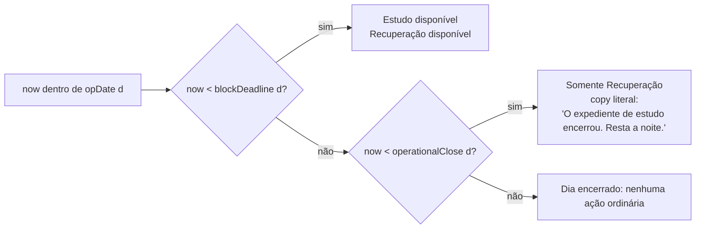

Regras associadas: iniciar Estudo é proibido após `night_end_time` (RF-01.13, RF-01.21); Estudo ativo que alcança `block_deadline` é encerrado exatamente nesse limite (RF-01.14); Recuperação e sua nota permanecem disponíveis até `day_close_time` (RF-01.19).

**Bloco órfão** (RF-01.15, RF-01.22, RNF-04.5): na próxima abertura ou no cruzamento de fronteira, `OrphanBlockCloser` grava `endedAt = blockDeadline` persistido, sem diálogo, sem reconciliação manual e sem alterar `operational_date`. Não existe estado, duração acumulada nem fluxo de reconciliação de timer no modelo (RD-10, Restrição 6.6).

**Reversibilidade em `open/unsealed`** (RF-01.23 a RF-01.26, RF-01.29):

| Ação | Pré-condição | Efeito |
|---|---|---|
| marcar/desmarcar treino ou briefing | `open/unsealed` | recomputa `morning` |
| ligar/desligar toggle do Dia | `open/unsealed` | recomputa `day` |
| editar/remover nota opcional | `open/unsealed` | nunca afeta conclusão |
| cancelar Estudo ativo | `open/unsealed` | `night` volta a incompleto; bloco-rascunho **descartado**, sem reatribuição de dados |
| iniciar novo Estudo após cancelamento | `open/unsealed` e `now < blockDeadline` | novo `StudyBlock` na **mesma** data operacional |
| substituir Estudo ↔ Recuperação | `open/unsealed`; para Estudo, `now < blockDeadline` | remoção torna `night` incompleto até nova conclusão |

O rótulo `"Treino de musculação"` é literal do ciclo atual, não categoria configurável (RF-01.28): é uma constante em `Copy`, sem tabela nem campo de categoria.

**Iniciativa de mudança** (RF-01.7, RD-25): índice único parcial garante no máximo uma `ChangeInitiative` ativa; `DayEntry` referencia a iniciativa vigente.

### 4. Dispensa de pilar com revogação

```dart
class PillarWaiver {
  final String id;
  final OperationalDate date;          // FK -> Day (RD-11)
  final Pillar pillar;
  final String reasonText;             // não vazio, <= 500 caracteres
  final bool recurrenceConfirmed;
  final TZDateTime? revokedAt;         // null == ativa
  bool get isActive => revokedAt == null;
}

abstract class WaiverPolicy {
  /// RF-02.9, RF-02.10: exige pilar e motivo não vazio; no máximo uma ativa por dia.
  Result<PillarWaiver, WaiverViolation> create(CreateWaiver cmd, DayContext ctx);

  /// RF-02.12 a RF-02.15: recorrência considera SOMENTE dispensas ativas do
  /// mesmo pilar em dias úteis consecutivos, ignorando dias mute.
  RecurrenceVerdict recurrence(Pillar pillar, OperationalDate date, WaiverHistory h);

  /// RF-02.23, RF-02.24: concluir pilar dispensado revoga a dispensa.
  Result<RevokeOutcome, WaiverViolation> revokeForCompletion(PillarWaiver w, DayContext ctx);
}

enum RecurrenceVerdict { first, requiresReturnRuleDialog }
```

**Unicidade parcial lógica** (RD-11): `CREATE UNIQUE INDEX waiver_one_active_per_day ON pillar_waivers(date) WHERE revoked_at IS NULL`. Dispensas revogadas não bloqueiam nova dispensa ativa no mesmo dia (RF-02.10, RF-02.26).

**Recorrência** (`WaiverRecurrence`, pura): caminha para trás a partir de `date` sobre a sequência de **dias úteis** (dias `mute` são pulados sem interromper). A cadeia daquele pilar é encerrada quando encontra dia útil com dispensa ativa **de outro** pilar, dia útil sem dispensa ativa daquele pilar, ou dia útil selado sem essa dispensa (RF-02.15). Dispensas revogadas nunca contam (RF-02.25). Se a cadeia anterior tem tamanho ≥ 1, a nova dispensa é a segunda ou posterior e exige, **antes de persistir**, diálogo que cite a Regra do Retorno, gravado em `recurrence_confirmed` (RF-02.14, RF-02.21).

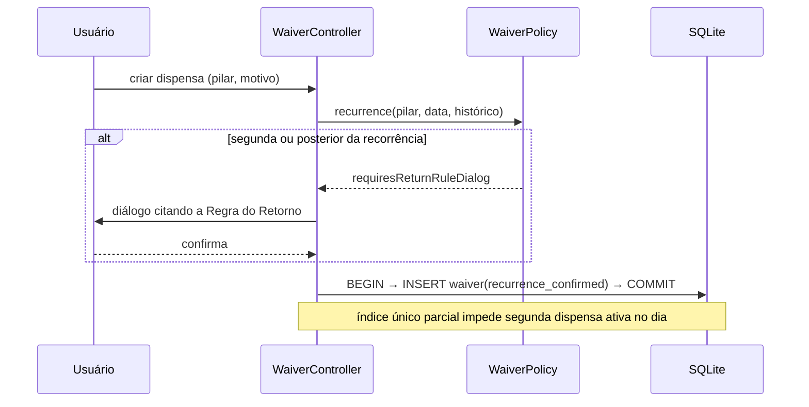

**Revogação positiva** (RF-02.23 a RF-02.28): ao tentar concluir um pilar com dispensa ativa, a UI pede confirmação neutra; confirmada, uma transação grava `revoked_at`, conclui o pilar e remove imediatamente o efeito da dispensa sobre selo e recorrência. A dispensa revogada permanece consultável no histórico do dia. Com `closed_at` preenchido a revogação é rejeitada (RF-02.27). Um dia com dispensa ativa que é selado conta integralmente no numerador e quebra qualquer sequência de não selados (RF-02.16, RF-03.6).

Enquanto o dia estiver `open/unsealed`, o pilar dispensado continua editável pelas mesmas regras de reversibilidade dos demais (RF-02.22).

### 5. Detector de sequência e protocolo idempotente

```dart
class EligibleDay {                     // projeção mínima usada pelo detector
  final OperationalDate date;
  final bool isWorkday;                 // seg-sex e sem feriado ativo
  final bool isClosed;
  final bool isSealed;
  final bool isMute;
}

class FailureSequence {
  final String generationId;            // "seq:" + primeira data (ISO)
  final OperationalDate startDate, endDate;
  final int length;                     // >= 2 para gerar protocolo
}

abstract class FailureSequenceDetector {
  /// Pura e determinística. Ignora dias mute e datas < activation_date.
  List<FailureSequence> detect(List<EligibleDay> timeline, OperationalDate activationDate);
}

enum ProtocolState { pending, answered, invalidated }
enum PlanOrExecution { plan, execution }

class ProtocolAlarm {
  final String id, generationId;
  final OperationalDate startDate, endDate;
  final int sequenceLength;
  final ProtocolState state;
  final ProtocolState? previousState;    // preservado na invalidação
  final TZDateTime? triggeredAt;
  final String? cause, adjustment;       // <= 2000 caracteres cada
  final PlanOrExecution? planOrExecution;
}
```

**Identidade da geração.** `generationId = "seq:" + startDate.iso`. A escolha é deliberada: enquanto a sequência apenas **cresce**, a data inicial não muda, então o mesmo protocolo é atualizado em `sequence_length`/`end_date` e nenhum outro é criado (RF-03.3, RF-03.4). Quando um feriado é aplicado ou removido e as sequências se fundem ou encurtam, a data inicial muda, produzindo uma **nova geração** — exatamente o comportamento exigido em RF-03.18 e RF-03.19.

**Idempotência atômica.** Índice único parcial: `CREATE UNIQUE INDEX protocol_one_live_per_generation ON protocol_alarms(generation_id) WHERE state <> 'invalidated'` (RD-14). A criação usa `INSERT ... ON CONFLICT DO NOTHING` dentro da transação de reconciliação, e o `ProtocolReconciler` é serializado por um mutex de processo. Execuções concorrentes convergem para **um** protocolo com o `sequence_length` correto (RF-03.8, RF-03.22).

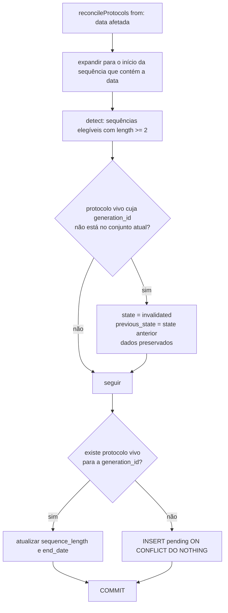

Propriedades do reconciliador: **determinístico** (mesma entrada, mesma saída), **idempotente** (`reconcile ∘ reconcile = reconcile`) e **não destrutivo** (nunca apaga registro, nunca reativa invalidado) — RF-03.17, RF-03.20, RNF-04.10.

**Sequência sobre o fim de semana** (RF-03.7): como dias `mute` são pulados na consecutividade, sexta e a segunda seguinte, ambas encerradas sem selo, pertencem à mesma sequência.

**Copy de um único dia** (RF-03.2): quando a sequência corrente tem exatamente um dia útil não selado, a tela Ritmo disponibiliza a copy literal `"Um dia perdido não é derrota; é dado."`, em cinza neutro, nunca vermelho (RF-03.1, RA-01.5).

**Apresentação por abertura** (RF-03.9 a RF-03.13):

```dart
class ProtocolSessionGate {
  /// Uma "abertura" = uma inicialização a frio do app.
  /// Seleciona o protocolo pending mais antigo e o marca como exibido nesta sessão.
  ProtocolAlarm? selectForThisLaunch(List<ProtocolAlarm> pending);
}
```

Vários protocolos podem permanecer `pending` simultaneamente; apenas o mais antigo é exibido na abertura, e responder a ele não revela outro na mesma sessão. O próximo só aparece em nova abertura. A apresentação abre **primeiro a Pedra e depois o formulário** (RF-03.13, RF-09.11), cujas três perguntas são literais: "o que causou?", "o problema é o plano ou a execução?", "qual o ajuste?" (RF-03.14). A conclusão persiste data de disparo, causa, classificação `plan|execution` e ajuste, e muda o estado para `answered` (RF-03.15).

Nenhum push, cobrança ou alerta externo decorre de dias não selados (RF-03.21, Restrição 6.5). O histórico de `pending|answered|invalidated` é consultável pela tela Ritmo (RF-03.20, RA-01.7).

### 6. Métricas

```dart
class MetricsCalculator {
  /// RF-02.17, RF-02.18, RF-04.3, RF-04.5
  Rate rate(List<EligibleDay> timeline, OperationalDate activationDate) {
    final denom = timeline.where((d) =>
        d.date >= activationDate && d.isWorkday && d.isClosed && !d.isMute);
    final num = denom.where((d) => d.isSealed);
    return Rate(numerator: num.length, denominator: denom.length);
  }
}
```

Excluídos do numerador e do denominador: datas anteriores a `activation_date`, dias abertos e dias `mute` (RF-02.18, RF-05.15). Dias selados com Recuperação e com Estudo contribuem **identicamente**: o cálculo não lê `NightKind` (RF-04.3, RF-04.5). Não há streak, recorde, ponto, recompensa, penalidade nem contador reiniciável em nenhuma camada (RF-02.19).

**Heatmap** (RA-01.5, RA-01.6, RA-01.8): `sealed` com destaque, dia útil encerrado `unsealed` em cinza neutro, `mute` vazio. A seleção de um dia mostra detalhes persistidos, incluindo classificação efetiva, `mute_cause` e `previous_result`. O layout é uma grade mensal sem conectores, sem rótulo de cadeia e sem contagem contínua, para não sugerir streak ou perda de progresso.

### 7. Recálculo de feriados

```dart
class HolidayRecalculation {
  /// Uma transação: Holiday + reclassificação de Day + reconciliação de protocolos.
  Future<RecalcReport> apply(OperationalDate date, {String? reasonText});
  Future<RecalcReport> remove(OperationalDate date, {String? reasonText});

  /// Prévia neutra exibida ANTES da confirmação (RF-05.26).
  RecalcPreview preview(OperationalDate date, HolidayOperation op);
}
```

```mermaid
sequenceDiagram
    participant U as Usuário
    participant H as HolidayController
    participant P as HolidayRecalculation
    participant DB as SQLite (1 transação)

    U->>H: marcar/desmarcar feriado (data, motivo opcional)
    H->>P: preview(data, operação)
    P-->>U: confirmação neutra com efeitos esperados em métricas e protocolos
    U-->>H: confirma
    H->>P: apply/remove
    P->>DB: BEGIN
    Note over P,DB: 1. upsert Holiday (ativo/inativo, created_at/removed_at, reason_text)
    Note over P,DB: 2. aplicar: previous_result = effective; effective = mute; mute_cause = holiday
    Note over P,DB: 3. remover: effective = previous_result; mute_cause = null
    Note over P,DB: 4. reconcileProtocols(from: data)
    P->>DB: COMMIT
    P-->>U: relatório neutro (nada apagado)
```

Garantias: nada é apagado — dia, pilares, selo, dispensas e histórico permanecem (RF-05.17, RD-16); `mute_cause`, `previous_result` e os instantes de criação/remoção com `reason_text` permanecem auditáveis (RF-05.18, RF-05.27); a autodeclaração prevalece, sem tratar a operação como fraude ou bloqueio (RF-05.28); protocolos invalidados nunca são restaurados, mesmo quando o critério volta a existir — cria-se um **novo** `pending` (RF-05.25, RF-03.18). O recálculo é determinístico, idempotente e não destrutivo (RNF-04.10). Métricas não são materializadas, portanto "recalcular métricas" (RF-05.16) é a invalidação dos providers de leitura derivada.

### 8. Scheduling de notificações com blackout

```dart
class BlackoutPolicy {
  /// Bloqueado em [sábado 00:00 civil, operationalOpen(segunda-feira)).
  bool isBlocked(TZDateTime candidate, Settings s);
}

enum NotificationKind { weeklyReviewSunday, weeklyReviewMonday }

class NotificationPlan {
  final String idempotencyKey;     // "<kind>:<week_start ISO>"
  final NotificationKind kind;
  final TZDateTime plannedAt;
  final PlanState state;           // planned | delivered | cancelled | suppressed
}

class NotificationScheduler {
  /// Recalcula todos os planos futuros; aplica blackout ANTES de persistir
  /// e ANTES de entregar/agendar no SO (RNF-04.7).
  Future<void> reconcilePlans();
}
```

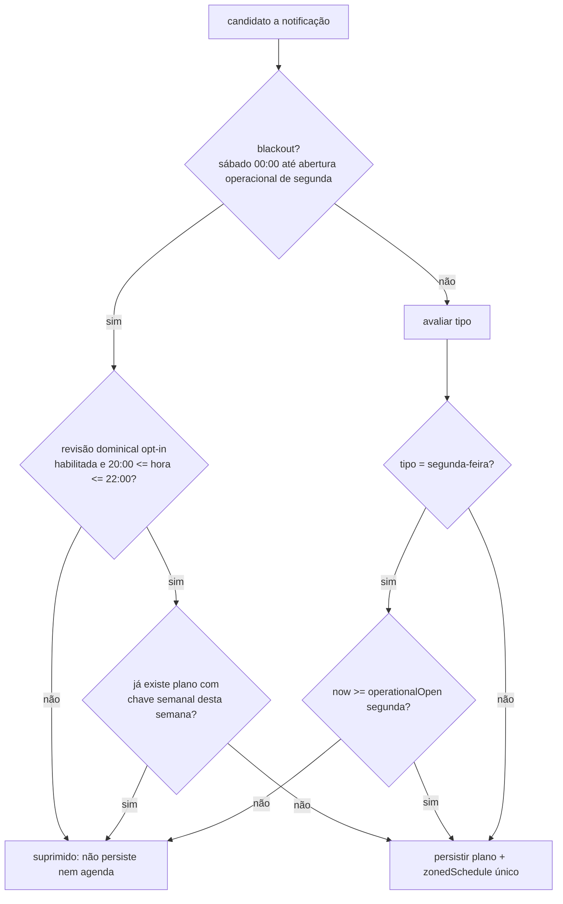

Regras implementadas: nenhum agendamento nem entrega de notificação diária durante o blackout (RF-05.19, RF-08.7); a única exceção é a revisão dominical opt-in, com exatamente um disparo entre 20:00 e 22:00, desligada por padrão, sem repetição, snooze automático ou follow-up (RF-05.20, RF-08.6, RF-08.8, RF-08.11, RF-08.16, RF-08.17); a notificação dominical abre diretamente o fluxo de Revisão **sem** alterar a home, sem retirar o `mute` e sem exibir pilares (RF-08.9, RF-08.12); a notificação de segunda ocorre uma única vez, somente após a abertura operacional de segunda-feira (RF-05.21, RF-08.13, RF-08.18); o fim do blackout é a abertura operacional de segunda-feira, nunca `max(03h, fechamento)` — 03:00 é apenas o padrão de `day_close_time` (RF-05.22, RF-08.14). Mudanças em configurações, feriados ou horários acionam `reconcilePlans`, que nunca viola o blackout (RF-08.15).

**Idempotência e validação na entrega.** Cada plano tem chave semanal única (`UNIQUE(idempotency_key)`), o que impede duplicatas em reagendamentos e em mudanças de fuso/relógio do aparelho (RNF-04.3, RNF-04.8, RNF-04.9). O agendamento usa `zonedSchedule` com `TZDateTime` construído no fuso oficial. Na entrega, o payload transporta a chave; ao processar o toque ou a inicialização a partir da notificação, o app **revalida** o instante contra `BlackoutPolicy` e a abertura operacional antes de abrir o fluxo, marcando o plano como `delivered` ou `suppressed` — segunda validação exigida por RNF-04.7 e RNF-04.8.

> **Nota de plataforma.** Alarmes exatos exigem `SCHEDULE_EXACT_ALARM`/`USE_EXACT_ALARM` no Android 13+ e podem lançar `ExactAlarmPermissionException` ([issue #1995](https://github.com/MaikuB/flutter_local_notifications/issues/1995)). Como nenhuma notificação do Ritmo é crítica ao segundo, o padrão é `AndroidScheduleMode.inexactAllowWhileIdle`, sem solicitar permissão de alarme exato; no Android 13+ apenas `POST_NOTIFICATIONS` é pedido, e a recusa mantém o app integralmente funcional (as notificações são opcionais em todas as fases).

Protocolos por falha, Encerramento de Ciclo e o badge de mentoria nunca geram notificação (RF-03.21, RF-06.10, RF-07.21, Restrição 6.5).

### 9. Ciclos e checkpoints

```dart
class Cycle { final String id, name, purposeText;
              final OperationalDate startDate, endDate;
              final CycleState state; }          // active | archived (read-only)
class Checkpoint { final String id, cycleId; final Competency competency;
                   final OperationalDate date; final CheckpointStatus status; }
enum Competency { st, in_, ca }                  // ST | IN | CA
enum GartnerLevel { bd, b, i, a, e }

class CyclePolicy {
  Checkpoint? nextFutureCheckpoint(Cycle c, List<Checkpoint> cps, OperationalDate today);
  int? countdownDays(Checkpoint? next, OperationalDate today);   // dias corridos
  bool awaitingClosure(Cycle c, List<Checkpoint> cps, OperationalDate today);
  bool shouldOfferClosureInvite(Cycle c, WeekStart week, InviteHistory h);
}
```

**Seed do MVP** (RF-06.1, RF-06.2, RF-06.16): ciclo ativo com a finalidade `"Nível Avançado em Strategic Thinking, Innovative e Change Advocate até Junho/2027 + consolidação de Business Acumen"` e exatamente três checkpoints: `2026-12-31` — Innovative; `2027-02-28` — Strategic Thinking; `2027-06-30` — Change Advocate. O seed é inserido pela migração inicial e coberto por teste de valores exatos.

**Home em dia útil** exibe a finalidade do ciclo ativo no topo (RF-06.3) e a contagem regressiva em dias corridos, no fuso oficial, para o próximo checkpoint futuro (RF-06.4).

**Estado derivado "aguardando encerramento"** (RF-06.8, RF-06.18, RF-06.19, RF-06.21): quando o ciclo ativo já passou do último checkpoint e o Encerramento de Ciclo não foi concluído, `awaitingClosure` é verdadeiro. Nunca há arquivamento automático, criação automática de ciclo ou fabricação de data (RF-06.15). A UI **oculta o countdown vencido**, mantém a finalidade visível e mostra apenas "aguardando encerramento" no lugar do contador. App e métricas seguem integralmente funcionais, sem bloqueio.

**Autoavaliação** (RF-06.5 a RF-06.7): quando a Revisão Semanal ocorre no mês civil de um checkpoint, o fluxo inclui a autoavaliação da competência correspondente, aceitando nível Gartner e notas opcionais; a evolução por competência é exibida sem gamificação.

**Convite e Encerramento de Ciclo** (RF-06.9 a RF-06.14, RF-06.17, RF-06.20): o convite aparece somente junto à Revisão Semanal, no máximo uma vez por semana operacional (controle por `week_start` em `CycleClosureInvite`), é adiável e não gera push. O fluxo inclui releitura do manifesto, avaliação final e campos de finalidade e checkpoints do novo ciclo; concluído, arquiva o ciclo anterior como read-only e ativa o novo. Avaliações e histórico são preservados por identificador. Editor de ciclos e Encerramento pertencem exclusivamente à Fase 3, cuja entrega antecede `2027-06-30`.

### 10. Pessoas: mentoria e contatos

```dart
class Mentorship { final String id; final Competency competency;   // ST|IN|CA
                   final String? mentorName; final OperationalDate? lastMeetingDate; }
class Contact { final String id, name; final String? contextNote;
                final OperationalDate? lastTouchDate; final TZDateTime createdAt; }
class WeeklyContactSuggestion { final OperationalDate weekStart;
                                final String contactId;
                                final SuggestionStatus status; }   // pending|done|skipped

class ContactOrdering {
  /// RF-07.5, RF-07.6: nulos primeiro; depois last_touch_date mais antiga;
  /// empate -> created_at mais antigo; desempate final estável por id.
  List<Contact> weeklyOrder(List<Contact> contacts);
}
```

**Entidades separadas** (RF-07.18 a RF-07.20, RF-07.22, RD-17, RD-18): `Mentorship` e `Contact` são tabelas e módulos distintos, sem FK, sem inferência de vínculo e sem sincronização. Um mentor só participa da ordem e do rodízio se for cadastrado explicitamente como `Contact`.

**Mentoria** (RF-07.1 a RF-07.3, RF-07.21): três cartões fixos (ST, IN, CA), com nome e data do último encontro editáveis. Passados mais de 30 dias, exibe alerta visual suave — único lembrete automático de mentor, sem push e sem reuso como recompensa (Restrição 6.2).

**Sugestão semanal** (RF-07.7 a RF-07.17):

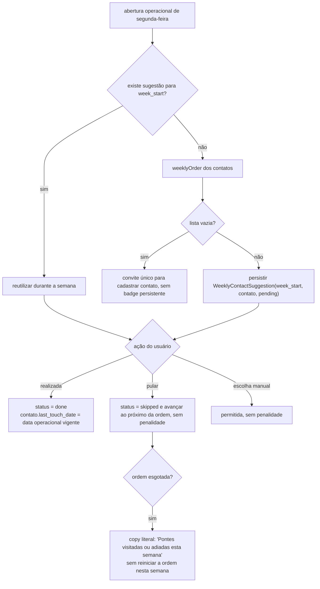

A ordem é calculada uma vez por semana operacional; contato criado no meio da semana **não** substitui a sugestão persistida (RF-07.8, RF-07.17). Junto à sugestão aparece a copy literal `"sem pedir nada"` (RF-07.14). Nada é premiado, pontuado ou penalizado (RF-07.15).

### 11. Revisão semanal

```dart
class WeeklyReview {
  final String id;
  final OperationalDate weekStart;      // semana operacional
  final String? fulfilled, failed, lesson;   // <= 5000 caracteres cada
  final AudioRef? audio;                     // Fase 3, <= 30 min
  final ReviewState state;                   // draft | finalized (read-only)
  final TZDateTime createdAt; final TZDateTime? autosavedAt, finalizedAt;
}
```

Fluxo guiado com as três perguntas literais "o que foi cumprido?", "o que falhou?" e "o que a falha ensina?" (RF-08.1), respostas em texto na Fase 2 e áudio local opcional na Fase 3, sem transcrição (RF-08.2, RF-08.3). Projetado para cerca de 20 minutos, sem permanência mínima (RF-08.4).

**Draft e finalização** (RF-08.22, RF-08.23, RF-08.25, RF-08.26): a revisão nasce `draft` com autosave local por campo (debounce curto, transação por gravação); interrupção e reabertura restauram o conteúdo salvo, **sem** finalização implícita. A finalização é explícita e torna o registro read-only, verificado por `GuardedWriter`.

**Histórico** (RF-08.19 a RF-08.21, RF-08.24): lista cronológica por semana operacional a partir da Fase 2, detalhe com as três respostas, áudio quando houver e avaliações de checkpoint associadas; estado vazio neutro; **sem busca e sem filtro**.

**Configuração** (RF-08.5, RA-01.2): domingo entre 20:00 e 22:00 **ou** segunda-feira em horário posterior à abertura operacional, no fuso oficial; validado por `ReviewScheduleValidator` e refletido em `NotificationScheduler`. Em domingo `mute`, o fluxo permanece acessível manualmente (RF-08.10).

### 12. Pedra, manifesto e parser do Juramento

```dart
class ManifestService {
  /// RF-09.2, RF-09.3, RF-09.13: copia o asset apenas quando não existe cópia local;
  /// nunca sobrescreve, mesmo após atualização do app.
  Future<Manifest> ensureLocalCopy();

  /// RF-09.5: fallback de leitura pelo asset, sem sobrescrever a cópia existente.
  Future<String> readForDisplay();

  /// RF-09.4, RD-34: salva a cópia editável; rejeita acima de 1 MiB UTF-8.
  Future<Result<Manifest, LimitViolation>> save(String markdown);
}

class OathParser {
  /// Retorna o intervalo de linhas do Juramento, ou null.
  LineRange? findOath(List<String> lines);
}
```

**Algoritmo do parser** (RF-09.7, RF-09.8, RF-09.10, RF-09.12):

1. Normalizar terminadores (`\r\n`, `\r` → `\n`) e dividir em linhas, preservando a ordem.
2. Localizar a **primeira** linha cujo conteúdo, após trim externo, seja exatamente `## IV. O JURAMENTO INTERNO`.
3. A partir da linha seguinte, ignorar linhas em branco (trim vazio).
4. Se a primeira linha não vazia posterior iniciar com `>` (após espaços iniciais), coletar o **primeiro bloco contíguo** de linhas iniciadas por `>`, parando na primeira linha que não inicie por `>`. Esse intervalo é o Juramento.
5. Caso o heading exato não exista, ou o primeiro conteúdo não vazio posterior não seja blockquote, retornar `null`.

Renderização: o manifesto é sempre renderizado **integralmente** e offline; quando `findOath` retorna um intervalo, somente esse bloco recebe fonte serifada itálica com destaque, sem alteração do texto (RF-09.6, RF-09.9). Quando retorna `null`, tudo é renderizado normalmente, sem erro e sem destaque (RF-09.10). Dois blocos blockquote separados por linhas em branco resultam em destaque apenas no primeiro (RF-09.12).

**Segurança do renderizador** (RF-09.6, RNF-02.5): o Markdown local é tratado como dado não confiável; a extensão de HTML bruto é desabilitada e nenhum script é executado. A Pedra precede o formulário quando há protocolo pendente selecionado (RF-09.11).

### 13. Navegação das cinco telas

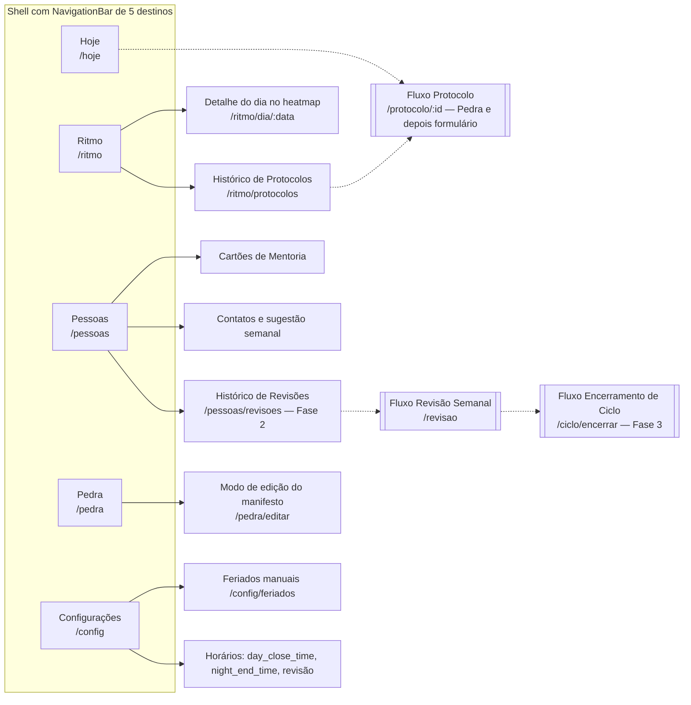

Cinco destinos de primeiro nível: **Hoje**, **Ritmo**, **Pessoas**, **Pedra**, **Configurações**. Protocolo, Revisão Semanal e Encerramento de Ciclo são **fluxos** apresentados sobre o shell, não destinos — condição para que a notificação dominical abra a Revisão sem alterar a home (RF-08.9) e para que o protocolo apresente a Pedra antes do formulário (RF-03.13). Fases: Hoje, Ritmo, Pedra e Configurações no MVP; Pessoas e o histórico de Revisões a partir da Fase 2.

Comportamento da tela Hoje conforme a data operacional:

| Estado do dia | Conteúdo |
|---|---|
| útil `open/unsealed` | finalidade do ciclo, countdown ou "aguardando encerramento", três pilares, ação "Selar o Dia" quando elegível |
| útil `open/sealed` | mesmos dados em leitura, ação explícita "Reabrir o Dia" |
| útil encerrado | read-only com aviso neutro |
| `mute` (weekend/holiday) | somente a frase literal `"Território sagrado. Presença integral."`; pilares e ações diárias ocultos |
| fuso divergente | indicador discreto de que datas e horários seguem `America/Sao_Paulo` |

---

## Data Models

### Visão geral do schema

Todas as entidades exigidas por RD-1 existem no schema da versão 1: o gating por fase é de **UI e fluxo**, nunca de persistência, para que o contrato de dados permaneça estável entre fases.

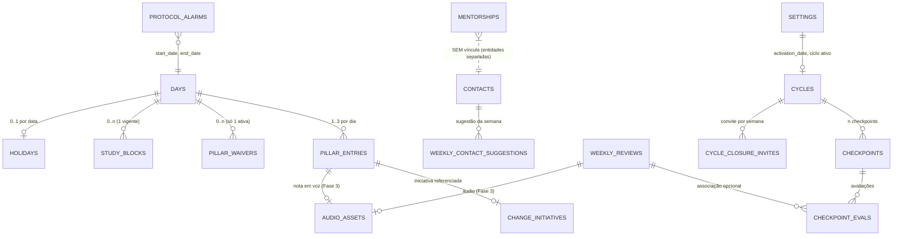

`MENTORSHIPS` e `CONTACTS` aparecem no diagrama apenas para deixar explícito que **não** há chave estrangeira, inferência ou sincronização entre eles (RF-07.18 a RF-07.20, RD-17, RD-18).

### Convenções de tipos

| Conceito | Coluna | Representação |
|---|---|---|
| Data operacional | `TEXT` | `YYYY-MM-DD` (data civil que nomeia o dia operacional), ordenável lexicograficamente |
| Instante | `INTEGER` | epoch em milissegundos UTC; convertido para `TZDateTime` no fuso oficial na leitura |
| Hora de configuração | `INTEGER` | minutos desde 00:00 civil (`day_close_time`, `night_end_time`, horário da revisão) |
| Enum | `TEXT` | valor literal com `CHECK` de domínio |
| Identificador | `TEXT` | UUID v4 gerado localmente |
| Booleano | `INTEGER` | 0/1 |

Instantes são armazenados em UTC e **sempre** reinterpretados em `America/Sao_Paulo` na leitura; nenhuma coluna guarda o fuso do aparelho (RF-05.1, RNF-04.1, RNF-04.2).

### Tabelas

#### `settings` (linha única, `id = 1`)

| Coluna | Tipo | Regra |
|---|---|---|
| `activation_date` | `TEXT?` | primeira data operacional de uso; gravada uma única vez (RF-05.7, RD-4) |
| `business_timezone` | `TEXT` | `CHECK (business_timezone = 'America/Sao_Paulo')` — imutável (RD-4) |
| `day_close_time_min` | `INTEGER` | padrão `180` (03h00); `CHECK BETWEEN 0 AND 240` (RF-05.3, RA-01.1) |
| `night_end_time_min` | `INTEGER` | `offset(night_end_time) ∈ (0, 1440]` validado no domínio (RA-01.1) |
| `review_weekday` | `TEXT` | `CHECK IN ('sunday','monday')` (RF-08.5) |
| `review_time_min` | `INTEGER` | domingo em `[1200,1320]`; segunda posterior à abertura operacional (RF-08.5) |
| `sunday_notification_enabled` | `INTEGER` | padrão `0` — desligada (RF-08.6) |
| `sync_enabled` | `INTEGER` | feature flag, padrão `0` no MVP (RA-01.4, RD-4) |

#### `days`

| Coluna | Tipo | Regra |
|---|---|---|
| `operational_date` | `TEXT` | **PK**, única (RD-2) |
| `base_result` | `TEXT` | `CHECK IN ('sealed','unsealed')` (RD-2) |
| `effective_result` | `TEXT` | `CHECK IN ('sealed','unsealed','mute')` (RD-2) |
| `closed_at` | `INTEGER?` | lifecycle independente do resultado (RF-05.6, RD-3) |
| `seal_timestamp` | `INTEGER?` | somente o último selo válido (RF-02.5) |
| `mute_cause` | `TEXT?` | `CHECK IN ('weekend','holiday')` (RD-2) |
| `previous_result` | `TEXT?` | resultado efetivo anterior ao feriado (RF-05.13, RD-2) |

`CHECK`s de integridade que espelham os invariantes da máquina de estados:

```sql
CHECK ((effective_result = 'mute') = (mute_cause IS NOT NULL))
CHECK (mute_cause IS NULL OR mute_cause <> 'holiday' OR previous_result IS NOT NULL)
CHECK ((base_result = 'sealed') = (seal_timestamp IS NOT NULL))
CHECK (mute_cause IS NOT NULL OR effective_result = base_result)
```

`operational_date` como chave primária é a defesa estrutural contra duplicação de dias em mudança de fuso ou relógio do aparelho (RNF-04.3) e garante um único `closed_at` lógico por dia (RNF-04.4).

#### `pillar_entries`

`(operational_date, pillar)` é **UNIQUE** — exatamente um registro por pilar por dia (RD-5).

| Coluna | Tipo | Regra |
|---|---|---|
| `operational_date` | `TEXT` | FK → `days` (RD-5, RD-38) |
| `pillar` | `TEXT` | `CHECK IN ('morning','day','night')` (RD-5) |
| `workout_done`, `briefing_done` | `INTEGER` | pilar `morning` (RD-6) |
| `briefing_mode` | `TEXT?` | `CHECK IN ('automatic','manual')` (RD-6) |
| `workout_at`, `briefing_at` | `INTEGER?` | instantes disponíveis (RD-6) |
| `toggle_on` | `INTEGER` | pilar `day`, toggle literal (RD-7) |
| `change_initiative_id` | `TEXT?` | FK → `change_initiatives` (RD-7) |
| `note_text` | `TEXT?` | ≤ 500 caracteres, sempre opcional (RD-7, RD-29) |
| `note_audio_id` | `TEXT?` | FK → `audio_assets`, Fase 3 (RD-7, RD-35) |
| `night_kind` | `TEXT?` | `CHECK IN ('study','recovery')` ou nulo (RD-8) |
| `recovery_note` | `TEXT?` | ≤ 500 caracteres (RD-8, RD-29) |
| `study_block_id` | `TEXT?` | FK → `study_blocks` (RD-8) |

Recuperação **não** possui coluna de timer, duração ou estado de reconciliação (RD-8, RD-10, Restrição 6.6).

#### `study_blocks`

| Coluna | Tipo | Regra |
|---|---|---|
| `id` | `TEXT` | PK |
| `operational_date` | `TEXT` | FK → `days`, **imutável** (RD-38, RNF-04.6) |
| `started_at` | `INTEGER` | início persistido (RF-01.12) |
| `block_deadline` | `INTEGER` | `night_end_time` daquela data (RF-01.12, RD-9) |
| `ended_at` | `INTEGER?` | nulo = órfão (RF-01.15, RD-9) |

```sql
CHECK (started_at <= block_deadline)
CHECK (ended_at IS NULL OR (ended_at >= started_at AND ended_at <= block_deadline))
```

Os `CHECK`s tornam impossível, no nível do banco, duração negativa e fim posterior ao deadline (RD-9, RNF-04.6). Não há coluna de estado nem de duração acumulada (RD-10).

#### `pillar_waivers`

| Coluna | Tipo | Regra |
|---|---|---|
| `id` | `TEXT` | PK (RD-11) |
| `date` | `TEXT` | FK → `days` (RD-11) |
| `pillar` | `TEXT` | `CHECK IN ('morning','day','night')` |
| `reason_text` | `TEXT` | `CHECK (length(trim(reason_text)) > 0)`, ≤ 500 caracteres (RF-02.9, RD-29) |
| `recurrence_confirmed` | `INTEGER` | diálogo da Regra do Retorno (RF-02.14, RD-11) |
| `revoked_at` | `INTEGER?` | nulo = ativa (RF-02.25, RD-11) |

```sql
CREATE UNIQUE INDEX waiver_one_active_per_day
  ON pillar_waivers(date) WHERE revoked_at IS NULL;
```

Unicidade **parcial lógica**: no máximo uma dispensa ativa por dia, múltiplas revogadas auditáveis no mesmo dia (RF-02.10, RF-02.26, RF-02.28, RD-11).

#### `protocol_alarms`

| Coluna | Tipo | Regra |
|---|---|---|
| `id` | `TEXT` | PK própria (RD-12) |
| `generation_id` | `TEXT` | identificador da geração da sequência (RD-12) |
| `start_date`, `end_date` | `TEXT` | limites da sequência (RD-12) |
| `sequence_length` | `INTEGER` | `CHECK (sequence_length >= 2)` (RF-03.3, RD-12) |
| `state` | `TEXT` | `CHECK IN ('pending','answered','invalidated')` (RD-12) |
| `previous_state` | `TEXT?` | estado preservado na invalidação (RF-03.16, RD-12) |
| `triggered_at` | `INTEGER?` | data de disparo da resposta (RF-03.15, RD-12) |
| `cause`, `adjustment` | `TEXT?` | ≤ 2000 caracteres cada (RD-12, RD-30) |
| `plan_or_execution` | `TEXT?` | `CHECK IN ('plan','execution')` (RD-13) |

```sql
CREATE UNIQUE INDEX protocol_one_live_per_generation
  ON protocol_alarms(generation_id) WHERE state <> 'invalidated';
CREATE INDEX protocol_pending_oldest ON protocol_alarms(start_date) WHERE state = 'pending';
```

O índice parcial dá atomicidade à unicidade "um protocolo vivo por geração" sem impedir vários `pending` de gerações distintas nem a criação de um novo protocolo depois de uma invalidação (RF-03.8, RF-03.9, RF-03.18, RD-14). Nenhuma atualização pode sair de `invalidated`: o `GuardedWriter` rejeita e não existe caminho de escrita que aceite `state = 'invalidated'` como origem (RF-03.17, RD-15).

#### `holidays`

| Coluna | Tipo | Regra |
|---|---|---|
| `operational_date` | `TEXT` | PK, FK → `days` (RD-16) |
| `active` | `INTEGER` | ativo/inativo (RD-16) |
| `created_at` | `INTEGER` | instante de criação (RD-16) |
| `removed_at` | `INTEGER?` | instante de remoção (RD-16) |
| `apply_reason_text` | `TEXT?` | motivo da aplicação, ≤ 500 caracteres (RF-05.27, RD-16) |
| `remove_reason_text` | `TEXT?` | motivo da remoção, ≤ 500 caracteres (RF-05.27, RD-16) |

Aplicar ou remover feriado nunca apaga registro: alterna `active` e preenche os instantes e motivos correspondentes (RF-05.17, RF-05.18, RD-16).

#### `mentorships` e `contacts`

| `mentorships` | Tipo | Regra |
|---|---|---|
| `id` | `TEXT` | PK |
| `competency` | `TEXT` | `CHECK IN ('ST','IN','CA')`, **UNIQUE** — três cartões fixos (RF-07.1, RD-17) |
| `mentor_name` | `TEXT?` | ≤ 120 caracteres (RF-07.2, RD-28) |
| `last_meeting_date` | `TEXT?` | data do último encontro (RF-07.2) |

| `contacts` | Tipo | Regra |
|---|---|---|
| `id` | `TEXT` | PK |
| `name` | `TEXT` | ≤ 120 caracteres (RF-07.4, RD-28) |
| `context_note` | `TEXT?` | ≤ 500 caracteres (RF-07.4, RD-29) |
| `last_touch_date` | `TEXT?` | opcional, nulos primeiro na ordem (RF-07.5, RD-18) |
| `created_at` | `INTEGER` | desempate determinístico (RF-07.6, RD-18) |

Não há FK, trigger ou job que crie `Contact` a partir de `Mentorship` (RF-07.19, RD-18).

#### `weekly_contact_suggestions`

| Coluna | Tipo | Regra |
|---|---|---|
| `week_start` | `TEXT` | data operacional da segunda-feira |
| `contact_id` | `TEXT` | FK → `contacts` (RD-19) |
| `status` | `TEXT` | `CHECK IN ('pending','done','skipped')` (RD-19) |
| `created_at` | `INTEGER` | ordem de progressão da semana |

`UNIQUE(week_start, contact_id)`. A progressão da semana é a sequência de registros daquele `week_start`: cada `skipped` acrescenta o próximo contato da ordem, e a ausência de reinício é consequência de nunca reinserir um `contact_id` já registrado na mesma semana (RF-07.10, RF-07.11, RD-19).

#### `cycles`, `checkpoints`, `checkpoint_evals`, `cycle_closure_invites`

| `cycles` | Regra |
|---|---|
| `name` | ≤ 120 caracteres (RD-20, RD-28) |
| `purpose_text` | ≤ 1000 caracteres (RD-20, RD-33) |
| `start_date`, `end_date` | período (RD-20) |
| `state` | `CHECK IN ('active','archived')`; `archived` é read-only (RD-20) |

`CREATE UNIQUE INDEX cycle_one_active ON cycles(state) WHERE state = 'active'`. "Aguardando encerramento" **não** é coluna: é derivado de ciclo ativo após o último checkpoint (RF-06.8, RD-20).

| `checkpoints` | Regra |
|---|---|
| `cycle_id` | FK → `cycles` (RD-21) |
| `competency` | `CHECK IN ('ST','IN','CA')` (RD-21) |
| `date` | data exata (RF-06.2, RD-21) |
| `status` | status do marco (RD-21) |

| `checkpoint_evals` | Regra |
|---|---|
| `checkpoint_id` | FK → `checkpoints` (RD-22) |
| `weekly_review_id` | FK opcional → `weekly_reviews` (RD-22) |
| `gartner_level` | `CHECK IN ('BD','B','I','A','E')` (RF-06.6, RD-22) |
| `notes` | ≤ 2000 caracteres (RD-32) |

`cycle_closure_invites(cycle_id, week_start)` com `UNIQUE(cycle_id, week_start)` implementa "no máximo uma vez por semana" do convite adiável, sem push (RF-06.9, RF-06.10, RF-06.17).

#### `weekly_reviews`

| Coluna | Regra |
|---|---|
| `week_start` | semana operacional, `UNIQUE` (RD-23) |
| `answer_fulfilled`, `answer_failed`, `answer_lesson` | ≤ 5000 caracteres cada (RD-23, RD-31) |
| `audio_id` | FK opcional → `audio_assets` (RD-23, RD-35) |
| `state` | `CHECK IN ('draft','finalized')`; `finalized` é read-only (RF-08.23, RD-23) |
| `created_at`, `autosaved_at`, `finalized_at` | instantes de criação, autosave e finalização (RD-23) |

```sql
CHECK ((state = 'finalized') = (finalized_at IS NOT NULL))
```

#### `manifests`

| Coluna | Regra |
|---|---|
| `id` | PK única (cópia local editável) |
| `content_markdown` | ≤ 1 MiB em UTF-8 (RD-24, RD-34) |
| `asset_version` | versão originária do asset (RD-24) |
| `first_copied_at`, `last_edited_at` | instantes (RD-24) |

A existência da linha é o próprio sinal de "cópia local existe": `ensureLocalCopy` só insere quando ausente, e nenhum caminho de código faz `UPDATE` a partir do asset (RF-09.3, RF-09.13).

#### `change_initiatives`

`CREATE UNIQUE INDEX initiative_one_active ON change_initiatives(active) WHERE active = 1` — no máximo uma iniciativa ativa (RF-01.7, RD-25). `name` ≤ 120 caracteres (RD-28).

#### `audio_assets`

| Coluna | Regra |
|---|---|
| `id` | PK |
| `relative_path` | referência ao arquivo local (RD-37) |
| `kind` | `CHECK IN ('day_note','weekly_review')` (RD-37) |
| `duration_ms` | `CHECK (duration_ms > 0)`; ≤ 5 min (`day_note`) e ≤ 30 min (`weekly_review`) validados no domínio (RD-35, RD-37) |
| `byte_size`, `created_at` | integridade e auditoria (RD-37) |

#### `notification_plans`

| Coluna | Regra |
|---|---|
| `idempotency_key` | **PK** — `"<kind>:<week_start>"` (RNF-04.8, RNF-04.9) |
| `kind` | `CHECK IN ('weekly_review_sunday','weekly_review_monday')` |
| `planned_at` | instante agendado no fuso oficial |
| `state` | `CHECK IN ('planned','delivered','cancelled','suppressed')` |

A chave primária semanal é o que impede repetição, reagendamento duplicado e follow-up (RF-08.11, RNF-04.3).

### Schema drift e migrações

```dart
@DriftDatabase(tables: [
  SettingsTable, Days, PillarEntries, StudyBlocks, PillarWaivers,
  ProtocolAlarms, Holidays, Mentorships, Contacts, WeeklyContactSuggestions,
  WeeklyReviews, Cycles, Checkpoints, CheckpointEvals, CycleClosureInvites,
  Manifests, ChangeInitiatives, AudioAssets, NotificationPlans,
])
class RitmoDatabase extends _$RitmoDatabase {
  @override int get schemaVersion => 1;

  @override
  MigrationStrategy get migration => MigrationStrategy(
    beforeOpen: (details) async {
      await customStatement('PRAGMA foreign_keys = ON');
      await customStatement('PRAGMA journal_mode = WAL');
    },
    onCreate: (m) async {
      await m.createAll();                 // tabelas + índices parciais
      await _seedV1();                     // settings, ciclo seed, 3 mentorias
    },
    onUpgrade: stepByStep(/* reservado */),
  );
}
```

Política de migração:

1. **Versão 1 (MVP)** cria o schema completo de RD-1, os índices parciais e o seed determinístico: linha de `settings` com `business_timezone = 'America/Sao_Paulo'`, `day_close_time_min = 180`, `night_end_time_min = 180`, `sunday_notification_enabled = 0`, `sync_enabled = 0`; ciclo seed ativo com finalidade e três checkpoints exatos (RF-06.1, RF-06.2, RF-06.16); três `mentorships` fixas (`ST`, `IN`, `CA`) sem nome preenchido (RF-07.1). `activation_date` permanece nulo até o primeiro uso, quando é gravado com a data operacional vigente (RF-05.7).
2. **Migrações são forward-only e aditivas.** Colunas e tabelas podem ser adicionadas; renomear ou remover coluna que carregue dado do usuário é proibido, o que preserva a garantia de que nada é apagado (RF-03.20, RF-05.18).
3. **Nenhuma migração reclassifica `operational_date`** de registro existente (RD-38).
4. **Versões reservadas:** v2 para metadados de execução da exportação (Fase 3) e v3 para metadados de sync criptografado (Fase 4). Ambas aditivas; enquanto as fases não chegam, a versão permanece 1.
5. `PRAGMA foreign_keys = ON` em toda abertura, garantindo que FK de `pillar_entries`, `study_blocks`, `pillar_waivers`, `checkpoint_evals` e `weekly_contact_suggestions` sejam efetivas.
6. Cada versão tem **schema dump** versionado no repositório; os testes de migração aplicam v(n-1) → v(n) sobre um banco povoado e verificam que nenhum registro é perdido ou reclassificado.

### Transações

RD-26 exige atomicidade em cinco operações. Cada uma é uma única `transaction` do drift:

| Operação | Escopo atômico | Requisito |
|---|---|---|
| Fechamento diário | `closed_at` do dia + fim de blocos órfãos em `block_deadline` + `reconcileProtocols` + `reconcilePlans` | RF-05.5, RF-01.15, RD-26 |
| Snapshot/autosave na fronteira | gravação do estado presente na data **original** + `closed_at` + trava de escrita | RF-05.31, RF-05.35, RNF-04.12, RD-26 |
| Selo / reabertura | `base_result` + `seal_timestamp` (ou limpeza) + `reconcileProtocols` | RF-02.2, RF-02.4, RF-03.6, RD-26 |
| Criação/atualização de protocolo | `INSERT ... ON CONFLICT DO NOTHING` + `UPDATE sequence_length/end_date` | RF-03.8, RF-03.22, RD-26 |
| Recálculo de feriado | `holidays` + reclassificação de `days` + invalidação/criação de protocolos + `reconcilePlans` | RF-05.16, RF-05.25, RD-26 |
| Revogação de dispensa por conclusão | `revoked_at` + conclusão do pilar | RF-02.24 |

Regras transversais: escritas de fronteira e persistência são **recuperáveis após interrupção** — o commit é o único ponto de visibilidade, e a materialização de fronteiras perdidas é idempotente porque `closed_at` só é escrito quando nulo (RNF-04.4, RNF-05.8). `GuardedDayWriter.assertMutable` roda **dentro** da transação, imediatamente antes da escrita, eliminando a janela entre verificação e gravação.

### Limites de dados

Fonte única em `core/limits.dart`, aplicada na entrada (UI), no domínio (`LimitPolicy`) e no banco (`CHECK` de `length`), sem limite mínimo implícito (RD-36, RNF-05.6):

| Campo | Limite | Unidade | Requisito |
|---|---|---|---|
| nomes editáveis (mentor, contato, ciclo, iniciativa) | 120 | caracteres Unicode | RD-28 |
| nota curta do pilar, nota de Recuperação, `PillarWaiver.reason_text`, contexto de `Contact` | 500 | caracteres Unicode | RD-29 |
| `ProtocolAlarm.cause`, `ProtocolAlarm.adjustment` | 2000 | caracteres Unicode | RD-30 |
| respostas de `WeeklyReview` (cada uma) | 5000 | caracteres Unicode | RD-31 |
| notas de `CheckpointEval` | 2000 | caracteres Unicode | RD-32 |
| `Cycle.purpose_text` | 1000 | caracteres Unicode | RD-33 |
| `Manifest.content_markdown` e asset do manifesto | 1 MiB | bytes UTF-8 | RD-34, RNF-05.7 |
| áudio da nota do Pilar do Dia | 5 min | duração | RD-35 |
| áudio de `WeeklyReview` | 30 min | duração | RD-35 |

"Caractere Unicode" é medido em **runes** (code points), não em unidades UTF-16, para que emoji e caracteres fora do BMP contem uma vez. O limite do manifesto é medido em bytes de `utf8.encode`.

```dart
class LimitPolicy {
  /// RNF-05.1: bloqueia apenas o excedente, preserva o conteúdo válido.
  ClampResult clampRunes(String input, int maxRunes);

  /// RD-34, RNF-05.7: rejeita salvamento acima de 1 MiB UTF-8.
  Result<void, LimitViolation> assertManifestSize(String markdown);
}
```

### Contrato de exportação

RA-01.9, RA-01.10, RD-27: no MVP o contrato é **definido e documentado**, sem execução, upload ou sync. Nenhum código de exportação é invocável no MVP; existe apenas o modelo do envelope e sua documentação.

```jsonc
{
  "schema": "ritmo.export",
  "schema_version": 1,
  "generated_at": "2026-05-04T12:00:00-03:00",
  "business_timezone": "America/Sao_Paulo",
  "settings": {
    "activation_date": "2026-01-05",
    "day_close_time": "03:00",
    "night_end_time": "01:30",
    "review": { "weekday": "sunday", "time": "21:00", "sunday_notification_enabled": false },
    "sync_enabled": false
  },
  "days": [{
    "operational_date": "2026-01-09",
    "base_result": "sealed",
    "effective_result": "mute",
    "mute_cause": "holiday",
    "previous_result": "sealed",
    "closed_at": "2026-01-10T03:00:00-03:00",
    "seal_timestamp": "2026-01-09T22:41:00-03:00",
    "derived": { "is_workday": false, "counts_in_metrics": false },
    "pillar_entries": [ /* morning, day, night com modo, notas e refs de áudio */ ],
    "study_blocks": [{ "id": "…", "operational_date": "2026-01-09",
                       "started_at": "…", "block_deadline": "…", "ended_at": "…" }],
    "pillar_waivers": [{ "id": "…", "pillar": "morning", "reason_text": "…",
                         "recurrence_confirmed": true, "revoked_at": "…" }]
  }],
  "holidays": [{ "operational_date": "2026-01-09", "active": true,
                 "created_at": "…", "removed_at": null,
                 "apply_reason_text": "…", "remove_reason_text": null }],
  "protocol_alarms": [{ "id": "…", "generation_id": "seq:2026-02-10",
                        "start_date": "…", "end_date": "…", "sequence_length": 3,
                        "state": "invalidated", "previous_state": "pending",
                        "triggered_at": "…", "cause": "…",
                        "plan_or_execution": "plan", "adjustment": "…" }],
  "cycles": [ /* + checkpoints + checkpoint_evals */ ],
  "mentorships": [ /* separado de contacts */ ],
  "contacts": [ /* + weekly_contact_suggestions */ ],
  "weekly_reviews": [ /* + state draft|finalized + audio_ref */ ],
  "manifest": { "asset_version": "…", "first_copied_at": "…",
                "last_edited_at": "…", "content_markdown": "…" },
  "change_initiatives": [ … ],
  "audio_assets": [{ "id": "…", "relative_path": "audio/…m4a",
                     "kind": "weekly_review", "duration_ms": 1234567,
                     "byte_size": 987654 }],
  "metrics_snapshot": { "numerator": 3, "denominator": 4 }
}
```

Garantias do contrato: preserva dados base, classificações efetivas, `mute_cause`, `previous_result` e estados derivados (`derived`, `metrics_snapshot`), além de identificadores, datas, estados e **referências** a áudio — os binários acompanham o pacote da Fase 3 pelo `relative_path`, e o JSON nunca embute áudio (RA-01.9, RD-27). O campo `schema_version` é versionado por fase; a execução local de JSON e áudios começa exclusivamente na Fase 3 (RA-01.11) e o backup criptografado, na Fase 4 (RA-01.12, RNF-02.4).

---

## Correctness Properties

*Uma propriedade é uma característica ou comportamento que deve ser verdadeiro em todas as execuções válidas do sistema — essencialmente, um enunciado formal sobre o que o sistema deve fazer. As propriedades são a ponte entre a especificação legível por humanos e as garantias de correção verificáveis por máquina.*

O PBT é apropriado aqui porque o núcleo do Ritmo é **domínio puro**: calendário operacional, máquina de estados do dia, detector de sequências, cálculo de taxa, ordenação de contatos, parser do Juramento e política de blackout são funções sobre estruturas imutáveis, com espaço de entrada grande e propriedades universais óbvias (round trip, invariância, idempotência, confluência).

Critérios classificados como exemplo, integração ou smoke na análise prévia — copies literais isoladas, seed do ciclo, gating de fase, desempenho, permissões, I/O de áudio — **não** geram propriedades; estão na Testing Strategy.

### Tempo operacional

### Propriedade 1: Particionamento da linha temporal operacional

*Para qualquer* `day_close_time` válido e *para qualquer* instante `t` no fuso oficial, existe exatamente uma data operacional `d` tal que `operationalOpen(d) <= t < operationalClose(d)`, e `operationalDateOf(t) == d`; além disso `operationalClose(d) == operationalOpen(d + 1 dia)`.

**Validates: Requirements RF-05.1, RF-05.4, RF-05.5, RF-05.9, RF-05.10, RF-05.11, RNF-04.1, RNF-04.2**

### Propriedade 2: Validação das fronteiras configuráveis

*Para qualquer* par de horários candidatos, a configuração é aceita se e somente se `day_close_time` está em `[00:00, 04:00]` e `offset(night_end_time)` está em `(0, 24h]`; toda configuração aceita satisfaz `blockDeadline(d) <= operationalClose(d)` para toda data `d`.

**Validates: Requirements RF-05.3, RA-01.1, RF-01.12**

### Propriedade 3: Particionamento da janela noturna

*Para qualquer* configuração válida, data operacional `d` e instante `t` com `operationalOpen(d) <= t < operationalClose(d)`: se `t < blockDeadline(d)` as alternativas disponíveis são exatamente `{study, recovery}`; caso contrário são exatamente `{recovery}` e a copy literal da janela restante é exibida.

**Validates: Requirements RF-01.11, RF-01.13, RF-01.17, RF-01.19, RF-01.21**

### Propriedade 4: Invariante do bloco de Estudo

*Para qualquer* sequência de comandos sobre blocos de Estudo, e *para qualquer* instante de retorno do aplicativo, todo `StudyBlock` persistido satisfaz `started_at <= block_deadline`, `ended_at == null` ou `started_at <= ended_at <= block_deadline`, mantém a `operational_date` de origem, e todo bloco órfão recebe `ended_at == block_deadline` sem qualquer evento de reconciliação manual.

**Validates: Requirements RF-01.12, RF-01.14, RF-01.15, RF-01.22, RD-9, RD-10, RNF-04.5, RNF-04.6**

### Pilares, selo e dispensa

### Propriedade 5: Conclusão de pilares

*Para qualquer* conjunto de registros de pilar e *qualquer* dispensa ativa, `morning` está concluído se e somente se (treino e briefing concluídos) ou a dispensa ativa é de `morning`; `day` está concluído se e somente se o toggle está ligado, independentemente de nota textual ou de voz; `night` está concluído se e somente se há Recuperação confirmada ou bloco de Estudo encerrado, sem qualquer exigência de duração mínima.

**Validates: Requirements RF-01.3, RF-01.9, RF-01.10, RF-01.16, RF-01.18, RF-02.11, RF-04.1, RF-04.2**

### Propriedade 6: Reversibilidade em `open/unsealed`

*Para qualquer* dia em `open/unsealed` e *qualquer* comando ordinário reversível (marcar/desmarcar treino ou briefing, ligar/desligar o toggle, editar/remover nota, cancelar Estudo, substituir Estudo por Recuperação e vice-versa), aplicar o comando e depois seu inverso restaura o mesmo estado de conclusão de pilares e a mesma elegibilidade de selo do estado inicial, sem alterar nenhuma `operational_date`.

**Validates: Requirements RF-01.23, RF-01.24, RF-01.25, RF-01.26, RF-01.29, RF-02.4, RF-02.22**

### Propriedade 7: Congelamento é absorvente

*Para qualquer* dia com `closed_at` preenchido e *para qualquer* Revisão Semanal `finalized`, *para qualquer* comando ordinário de escrita, o comando é rejeitado e o estado persistido permanece idêntico byte a byte; as únicas mutações aceitas em dia encerrado são a aplicação e a remoção de feriado, que alteram exclusivamente `effective_result`, `mute_cause` e `previous_result`.

**Validates: Requirements RF-01.27, RF-02.6, RF-02.27, RF-05.32, RF-08.23, RF-08.26**

### Propriedade 8: Elegibilidade do selo

*Para qualquer* estado de conclusão dos três pilares e *qualquer* dispensa ativa, o selo é permitido se e somente se o conjunto de pilares incompletos é vazio, ou tem exatamente um elemento e esse elemento é o pilar coberto pela dispensa ativa.

**Validates: Requirements RF-02.1, RF-02.2, RF-02.3, RF-02.7, RF-02.8**

### Propriedade 9: Selo e reabertura preservam apenas o último timestamp

*Para qualquer* dia elegível e *qualquer* sequência de ações alternadas “Selar o Dia” e “Reabrir o Dia”, o estado final tem `seal_timestamp` nulo quando `unsealed` e igual ao instante do último selo aplicado quando `sealed`; nenhum timestamp intermediário é preservado.

**Validates: Requirements RF-02.2, RF-02.4, RF-02.5**

### Propriedade 10: Dispensa exige motivo com conteúdo

*Para qualquer* string de motivo, a criação da dispensa é aceita se e somente se a string possui pelo menos um caractere não branco após trim, e é sempre acompanhada de um pilar declarado.

**Validates: Requirements RF-02.9**

### Propriedade 11: No máximo uma dispensa ativa, com histórico monotônico

*Para qualquer* sequência de criações e revogações de dispensa em um dia aberto, o número de dispensas com `revoked_at` nulo é sempre menor ou igual a um, o número total de dispensas do dia nunca diminui, e apenas a dispensa ativa produz efeito sobre elegibilidade de selo e recorrência.

**Validates: Requirements RF-02.10, RF-02.25, RF-02.26, RF-02.28, RD-11**

### Propriedade 12: Recorrência de dispensa segue o modelo de referência

*Para qualquer* linha do tempo com dias úteis, dias `mute`, dispensas ativas e revogadas de pilares variados, o veredito de recorrência de um novo pedido coincide com o de uma implementação de referência que caminha para trás sobre dias úteis, ignora dias `mute`, conta somente dispensas ativas do mesmo pilar e corta a cadeia ao encontrar dispensa ativa de outro pilar, dia útil sem dispensa ativa daquele pilar ou dia útil selado sem essa dispensa.

**Validates: Requirements RF-02.12, RF-02.13, RF-02.14, RF-02.15, RF-02.21**

### Métricas

### Propriedade 13: Fórmula da taxa

*Para qualquer* linha do tempo e *qualquer* `activation_date`, a taxa é igual a `|{d : d >= activation_date, d é dia útil, d encerrado, d não mute, d selado}| / |{d : d >= activation_date, d é dia útil, d encerrado, d não mute}|`; dias abertos, dias `mute` e dias anteriores a `activation_date` não aparecem em numerador nem denominador, e um dia selado com dispensa ativa contribui integralmente.

**Validates: Requirements RF-02.16, RF-02.17, RF-02.18, RF-02.20, RF-05.8, RF-05.15**

### Propriedade 14: Estudo e Recuperação são equivalentes na métrica

*Para qualquer* linha do tempo, substituir arbitrariamente o `night_kind` de qualquer conjunto de dias selados entre `study` e `recovery` não altera o numerador, o denominador nem o conjunto de sequências de falha detectadas.

**Validates: Requirements RF-04.3, RF-04.5**

### Propriedade 15: Recuperação é indistinguível na apresentação

*Para qualquer* par de dias selados idênticos exceto pelo `night_kind`, as projeções de apresentação produzem os mesmos tokens de cor, o mesmo ícone, o mesmo rótulo de estado, o mesmo peso de métrica e a mesma posição relativa de ordenação.

**Validates: Requirements RF-04.4**

### Sequências de falha e protocolo

### Propriedade 16: Consecutividade ignora dias `mute` e o período pré-ativação

*Para qualquer* linha do tempo, inserir dias `mute` em posições arbitrárias entre dias úteis não altera o conjunto de sequências de falha detectadas; nenhum dia anterior a `activation_date` participa de sequência; e a inserção de um dia útil selado em qualquer posição parte a sequência que o contém.

**Validates: Requirements RF-03.5, RF-03.6, RF-03.7, RF-02.16**

### Propriedade 17: Um protocolo vivo por geração, idempotente sob repetição

*Para qualquer* linha do tempo e *qualquer* número de execuções do reconciliador, inclusive intercaladas, existe no máximo um protocolo com estado diferente de `invalidated` por `generation_id`, seu `sequence_length` e `end_date` correspondem exatamente à sequência detectada, e nenhuma sequência com dois ou mais dias fica sem protocolo vivo.

**Validates: Requirements RF-03.3, RF-03.4, RF-03.8, RF-03.22, RD-14**

### Propriedade 18: A invalidação é absorvente e o histórico nunca encolhe

*Para qualquer* sequência de aplicações e remoções de feriado seguidas de reconciliação, nenhum protocolo transita de `invalidated` para outro estado, todo protocolo invalidado preserva `previous_state`, `cause`, `plan_or_execution` e `adjustment`, a contagem total de protocolos é monotonicamente não decrescente, e sempre que o critério volta a existir há um protocolo `pending` novo para a geração recalculada.

**Validates: Requirements RF-03.16, RF-03.17, RF-03.18, RF-03.19, RF-03.20, RF-03.24, RF-05.25, RD-15, RNF-04.10**

### Propriedade 19: Um protocolo por abertura, o mais antigo primeiro

*Para qualquer* conjunto de protocolos `pending` e *qualquer* sequência de aberturas do aplicativo com respostas, cada abertura exibe no máximo um protocolo, o exibido é o de menor `start_date` entre os pendentes naquele instante, e responder a ele não exibe nenhum outro na mesma sessão.

**Validates: Requirements RF-03.9, RF-03.10, RF-03.11, RF-03.12, RF-03.23**

### Propriedade 20: Copy de dia único

*Para qualquer* linha do tempo, a copy literal de dia perdido está disponível se e somente se a sequência corrente de dias úteis encerrados e não selados tem exatamente um elemento.

**Validates: Requirements RF-03.2**

### Feriados

### Propriedade 21: Round trip de feriado restaura o resultado anterior

*Para qualquer* dia e *qualquer* motivo opcional, aplicar feriado e depois removê-lo restaura o `effective_result` original, preserva `base_result`, `seal_timestamp`, registros de pilar, blocos, dispensas e `closed_at`, e mantém o registro de `Holiday` com instantes e motivos auditáveis.

**Validates: Requirements RF-05.13, RF-05.17, RF-05.18, RF-05.27, RF-05.28, RD-16**

### Propriedade 22: Recálculo idempotente e não destrutivo

*Para qualquer* linha do tempo e *qualquer* sequência de operações de feriado, executar o recálculo repetidamente a partir da mesma data produz exatamente o mesmo estado (idempotência), o resultado depende apenas do estado de entrada (determinismo), e nenhum registro de dia, pilar, bloco, dispensa, protocolo ou revisão é apagado.

**Validates: Requirements RF-05.16, RF-05.36, RNF-04.10, RNF-05.5**

### Fronteira operacional e integridade transacional

### Propriedade 23: Atomicidade da fronteira em foreground

*Para qualquer* estado de edição diária pendente e *qualquer* instante de fronteira observado com o aplicativo em foreground, o estado presente naquele instante é gravado na `operational_date` original, `closed_at` daquela data é preenchido exatamente uma vez, os dois efeitos aparecem juntos ou não aparecem, a tela do dia passa a rejeitar toda escrita ordinária, nenhum dado é reatribuído à nova data e nenhuma notificação é emitida.

**Validates: Requirements RF-05.29, RF-05.30, RF-05.31, RF-05.32, RF-05.34, RF-05.35, RNF-04.11, RNF-04.12**

### Propriedade 24: Fluxos não diários atravessam a fronteira intactos

*Para qualquer* estado de fluxo não vinculado ao dia (Revisão Semanal ou Pedra) e *qualquer* instante de fronteira, o estado do fluxo após a fronteira é igual ao anterior, e apenas o contexto de data operacional é atualizado.

**Validates: Requirements RF-05.33, RNF-04.13**

### Propriedade 25: Transações são tudo ou nada

*Para qualquer* uma das operações atômicas declaradas (fechamento diário, snapshot na fronteira, selo, criação de protocolo, recálculo de feriado, revogação de dispensa por conclusão) e *qualquer* ponto de interrupção antes do commit, o estado persistido é igual ao estado anterior à operação; após o commit, todos os efeitos declarados estão presentes, e nenhum texto, metadado ou arquivo previamente válido é corrompido.

**Validates: Requirements RD-26, RNF-05.5, RNF-05.8**

### Propriedade 26: Unicidade por chave lógica sob mudança de fuso e relógio

*Para qualquer* sequência de mudanças de fuso ou de relógio do aparelho e *qualquer* sequência de reaberturas do aplicativo, existe no máximo um registro por chave lógica de `Day` (`operational_date`), dispensa ativa, protocolo vivo por geração, sugestão semanal por semana, revisão por semana e plano de notificação por chave semanal; e cada dia encerrado possui exatamente um `closed_at`.

**Validates: Requirements RNF-04.3, RNF-04.4, RD-2**

### Propriedade 27: `operational_date` nunca é reclassificada

*Para qualquer* sequência de comandos, incluindo fechamentos de fronteira, cancelamentos de Estudo, substituições noturnas, recálculos de feriado e falhas de persistência, o multiconjunto de pares `(id, operational_date)` dos registros preexistentes permanece inalterado.

**Validates: Requirements RF-01.20, RF-05.32, RD-38**

### Notificações e blackout

### Propriedade 28: Nenhum plano persistido viola o blackout

*Para qualquer* sequência de mudanças de configuração, horários e feriados, após cada reconciliação de agendamentos todo plano persistido com `state = planned` satisfaz: seu instante não pertence a `[sábado 00:00 civil, operationalOpen(segunda-feira))`, ou é a exceção dominical explicitamente habilitada dentro de `[20:00, 22:00]`; o fim do blackout depende apenas de `operationalOpen(segunda-feira)` e não de `max(03:00, day_close_time)`.

**Validates: Requirements RF-05.19, RF-05.22, RF-05.24, RF-08.7, RF-08.15, RNF-04.7**

### Propriedade 29: Unicidade semanal e janela de entrega das notificações

*Para qualquer* número de tentativas de agendamento e de eventos de entrega, dispensa ou ignorar dentro da mesma semana operacional, existe no máximo um plano por chave `(kind, week_start)` e no máximo uma entrega por chave; nenhuma notificação de segunda-feira é entregue antes de `operationalOpen(segunda-feira)`; e nenhum reagendamento, snooze automático ou follow-up é criado.

**Validates: Requirements RF-05.20, RF-05.21, RF-08.8, RF-08.11, RF-08.13, RF-08.14, RF-08.17, RF-08.18, RNF-04.8, RNF-04.9**

### Projeções da home

### Propriedade 30: A exceção dominical não altera a home

*Para qualquer* domingo, a projeção da home com a notificação dominical habilitada, entregue e aberta é idêntica à projeção com a notificação desabilitada: permanece `mute`, sem pilares e sem ações diárias, e a data operacional vigente é a mesma.

**Validates: Requirements RF-05.20, RF-08.9, RF-08.12**

### Propriedade 31: Projeção do dia `mute`

*Para qualquer* dia com `effective_result = mute`, seja por fim de semana ou por feriado, a projeção da home contém exatamente a frase literal de território sagrado e nenhum pilar, ação diária, toggle, timer ou ação de selo.

**Validates: Requirements RF-05.12, RF-05.14**

### Ciclos e checkpoints

### Propriedade 32: Próximo checkpoint e contagem regressiva

*Para qualquer* conjunto de checkpoints e *qualquer* data operacional de hoje, o checkpoint apresentado é o de menor data estritamente futura, a contagem regressiva é a diferença em dias corridos no fuso oficial e é sempre maior ou igual a zero; quando não existe checkpoint futuro, nenhuma data ou ciclo é fabricado e nenhuma contagem vencida é exibida.

**Validates: Requirements RF-06.4, RF-06.15, RF-06.18**

### Propriedade 33: “Aguardando encerramento” é derivado e não bloqueia

*Para qualquer* ciclo `active` e *qualquer* data posterior ao seu último checkpoint sem Encerramento de Ciclo concluído, o estado derivado é “aguardando encerramento”, o ciclo permanece `active`, a finalidade permanece visível, nenhum ciclo é criado ou arquivado automaticamente, e a taxa e o heatmap continuam produzindo os mesmos valores que produziriam antes do último checkpoint.

**Validates: Requirements RF-06.8, RF-06.19, RF-06.21**

### Propriedade 34: Rollover de ciclo preserva histórico

*Para qualquer* ciclo com checkpoints e avaliações, concluir o Encerramento de Ciclo deixa exatamente um ciclo `active`, marca o anterior como `archived` e read-only, e mantém toda avaliação e todo checkpoint acessíveis pelos identificadores originais.

**Validates: Requirements RF-06.11, RF-06.12, RF-06.14, RD-20**

### Propriedade 35: Convite de encerramento no máximo uma vez por semana

*Para qualquer* histórico de convites e *qualquer* número de aberturas da Revisão Semanal dentro da mesma semana operacional, no máximo um convite de Encerramento de Ciclo é apresentado, o adiamento nunca o transforma em obrigatório, e nenhuma notificação é enviada.

**Validates: Requirements RF-06.9, RF-06.10, RF-06.17**

### Propriedade 36: Autoavaliação no mês civil do checkpoint

*Para qualquer* par (semana da Revisão Semanal, conjunto de checkpoints), a autoavaliação de uma competência é incluída no fluxo se e somente se a revisão ocorre no mesmo mês civil do checkpoint dessa competência; níveis aceitos são exatamente `BD`, `B`, `I`, `A`, `E`.

**Validates: Requirements RF-06.5, RF-06.6, RD-22**

### Pessoas

### Propriedade 37: Ordem semanal é uma ordem total determinística

*Para qualquer* lista de contatos, a ordem semanal coloca primeiro todos os contatos com `last_touch_date` nula, depois os demais por `last_touch_date` crescente, empates resolvidos por `created_at` crescente e empates remanescentes por `id`; a ordem é a mesma em execuções repetidas com a mesma entrada.

**Validates: Requirements RF-07.5, RF-07.6, RF-07.16, RD-18**

### Propriedade 38: A sugestão persistida é estável na semana

*Para qualquer* sugestão persistida para uma `week_start` e *qualquer* sequência de criações ou edições de contatos dentro da mesma semana, o `contact_id` da sugestão vigente permanece o mesmo até a próxima abertura operacional de segunda-feira.

**Validates: Requirements RF-07.7, RF-07.8, RF-07.17**

### Propriedade 39: Progressão semanal sem reinício nem penalidade

*Para qualquer* lista de contatos e *qualquer* sequência de ações de pular, marcar como realizada e escolher manualmente, nenhum `contact_id` é sugerido duas vezes na mesma semana, marcar como realizada define `status = done` e atualiza `last_touch_date` para a data operacional vigente, esgotar a ordem exibe a copy literal correspondente sem reiniciar a ordem, e nenhum campo de mérito, ponto ou penalidade é alterado.

**Validates: Requirements RF-07.9, RF-07.10, RF-07.11, RF-07.12, RF-07.15, RD-19**

### Propriedade 40: Mentoria e Contatos permanecem separados

*Para qualquer* conjunto de mentorias e *qualquer* conjunto de contatos, a ordem semanal e a sugestão contêm exclusivamente identificadores de `Contact`; nenhuma mentoria é convertida, vinculada ou sincronizada implicitamente em contato.

**Validates: Requirements RF-07.18, RF-07.19, RF-07.20, RF-07.22, RD-17, RD-18**

### Propriedade 41: Badge de recência de mentoria

*Para qualquer* par (data operacional de hoje, `last_meeting_date`), o alerta visual suave é exibido se e somente se transcorreram mais de 30 dias, e em nenhum caso uma notificação é agendada ou entregue.

**Validates: Requirements RF-07.3, RF-07.21**

### Revisão semanal

### Propriedade 42: Autosave sem finalização implícita

*Para qualquer* sequência de edições parciais em uma Revisão Semanal seguida de interrupção e reabertura, o conteúdo restaurado é igual ao último conteúdo salvo automaticamente, e o estado permanece `draft` até uma finalização explícita.

**Validates: Requirements RF-08.22, RF-08.25**

### Propriedade 43: Histórico de revisões cronológico e completo

*Para qualquer* conjunto de revisões, o histórico as apresenta ordenadas por semana operacional, e o detalhe de cada uma expõe as três respostas persistidas, a referência de áudio quando existir e todas as avaliações de checkpoint associadas, sem oferecer busca, filtro ou ação de edição em revisões `finalized`.

**Validates: Requirements RF-08.19, RF-08.20, RF-08.24, RF-08.26**

### Pedra e manifesto

### Propriedade 44: A cópia local do manifesto é idempotente e nunca sobrescrita

*Para qualquer* conteúdo de cópia local e *qualquer* número de chamadas de garantia de cópia e de leitura para exibição, inclusive após troca da versão do asset, o conteúdo da cópia local permanece exatamente o mesmo; quando a cópia está ausente, o asset é usado somente para leitura.

**Validates: Requirements RF-09.2, RF-09.3, RF-09.5, RF-09.13**

### Propriedade 45: Parser do Juramento

*Para qualquer* documento Markdown, o parser retorna um intervalo não vazio se e somente se existe uma linha cujo conteúdo após trim é exatamente o heading do Juramento e a primeira linha não vazia posterior inicia por `>`; nesse caso o intervalo retornado é exatamente o primeiro bloco contíguo de linhas iniciadas por `>`, o texto original não é modificado em nenhum caractere, e o documento é renderizado integralmente em todos os casos, com ou sem destaque.

**Validates: Requirements RF-09.7, RF-09.8, RF-09.9, RF-09.10, RF-09.12**

### Propriedade 46: Renderização de Markdown não executa HTML

*Para qualquer* conteúdo Markdown local, inclusive com tags HTML, atributos de evento e blocos de script arbitrários, a árvore renderizada não contém nenhum nó executável e o texto legível do documento permanece presente na íntegra.

**Validates: Requirements RF-09.6, RNF-02.5**

### Integridade, limites e interoperabilidade

### Propriedade 47: Limites textuais em caracteres Unicode

*Para qualquer* string Unicode arbitrária, incluindo pares surrogate e marcas combinantes, e *qualquer* campo com limite declarado em caracteres, a entrada resultante preserva integralmente o prefixo válido, tem no máximo o número declarado de runes, bloqueia apenas o excedente e nunca aplica truncamento silencioso nem impõe limite mínimo.

**Validates: Requirements RD-28, RD-29, RD-30, RD-31, RD-32, RD-33, RD-36, RNF-05.1, RNF-05.6**

### Propriedade 48: Limite do manifesto em bytes UTF-8

*Para qualquer* conteúdo Markdown, o salvamento da cópia editável é aceito se e somente se o conteúdo codificado em UTF-8 tem no máximo 1 MiB, e uma rejeição nunca altera a cópia previamente válida.

**Validates: Requirements RD-34, RNF-05.7, RF-09.4**

### Propriedade 49: Round trip do contrato de exportação

*Para qualquer* estado agregado válido, serializar segundo o contrato de exportação e desserializar produz um agregado equivalente, preservando identificadores, datas operacionais, instantes no fuso oficial, estados, `mute_cause`, `previous_result`, estados derivados e referências de áudio com tipo e duração.

**Validates: Requirements RA-01.9, RD-27, RD-37**

### Propriedade 50: O detalhe do dia reflete o que está persistido

*Para qualquer* dia persistido, a projeção de detalhe do heatmap expõe exatamente a classificação efetiva, `mute_cause` e `previous_result` gravados, e o mapeamento visual é destaque para `sealed`, cinza neutro para dia útil encerrado `unsealed` e vazio para `mute`, sem nenhum elemento de cadeia, contador contínuo ou conector entre dias.

**Validates: Requirements RA-01.5, RA-01.6, RA-01.8**

### Propriedade 51: Espaço insuficiente impede gravação e exportação

*Para qualquer* par (espaço livre estimado, tamanho estimado da operação), a gravação de áudio ou a exportação inicia se e somente se o espaço livre é suficiente; quando insuficiente, nenhum arquivo parcial é apresentado como válido e nenhum dado anterior é alterado.

**Validates: Requirements RNF-05.3, RNF-05.4**

### Antigamificação e linguagem

### Propriedade 52: Catálogo de copies literais e sóbrias

*Para qualquer* constante do catálogo de copies, o texto não contém emoji nem nenhum termo do conjunto proibido (streak, sequência recorde, pontos, badge de recompensa, ranking, punição, vergonha), e toda copy declarada literal na especificação é exatamente igual ao seu texto declarado.

**Validates: Requirements RF-02.19, RF-01.8, RF-01.28, RF-03.2, RF-03.14, RF-05.14, RF-07.11, RF-07.14, RF-08.1, RNF-03.3, RNF-03.4**

### Propriedade 53: Iniciativa de mudança única

*Para qualquer* sequência de comandos sobre iniciativas de mudança, o número de iniciativas ativas é sempre menor ou igual a um.

**Validates: Requirements RF-01.7, RD-25**

### Propriedade 54: Escalabilidade tipográfica sem perda de ações

*Para qualquer* fator de escala de fonte na faixa suportada pelo sistema, as ações essenciais de cada tela permanecem presentes e acionáveis, sem overflow que oculte conteúdo.

**Validates: Requirements RNF-03.1**

---

## Error Handling

### Princípios

1. **Erro previsto não é exceção.** Toda violação de regra de negócio retorna `Result<T, Violation>`; exceções ficam reservadas para falhas de infraestrutura (I/O, banco, permissão).
2. **Tom neutro sempre.** Nenhuma mensagem de erro usa culpa, punição, vermelho de alarme ou linguagem motivacional (RNF-03.3, RF-03.1).
3. **Falha nunca corrompe.** Toda escrita passa por transação; o commit é o único ponto de visibilidade, então uma falha deixa o estado anterior intacto (RNF-05.5, RNF-05.8).
4. **Falha nunca reclassifica data.** Nenhum caminho de recuperação move registro entre datas operacionais (RD-38).

### Taxonomia

```dart
sealed class RitmoFailure { }

// Regras de negócio — recuperáveis, tratadas na UI com mensagem neutra
class DayViolation      extends RitmoFailure { }  // congelado, transição inválida, selo inelegível
class NightWindowViolation extends RitmoFailure { }  // Estudo após night_end_time
class WaiverViolation   extends RitmoFailure { }  // motivo vazio, segunda ativa, revogação em dia encerrado
class LimitViolation    extends RitmoFailure { }  // excedente textual, manifesto > 1 MiB
class ConfigViolation   extends RitmoFailure { }  // day_close_time fora da faixa, revisão fora dos limites

// Infraestrutura — recuperáveis com retentativa ou degradação
class StorageFailure    extends RitmoFailure { }  // espaço insuficiente, I/O de arquivo
class DatabaseFailure   extends RitmoFailure { }  // transação abortada, constraint inesperada
class AudioFailure      extends RitmoFailure { }  // codec, permissão de microfone
class NotificationFailure extends RitmoFailure { }  // permissão negada, agendamento rejeitado
class ManifestFailure   extends RitmoFailure { }  // asset ausente ou ilegível
```

### Tratamento por classe de falha

| Situação | Comportamento | Requisito |
|---|---|---|
| Comando ordinário em dia encerrado | rejeição antes de qualquer escrita, aviso neutro de que o dia está encerrado | RF-01.27, RF-02.6 |
| Iniciar Estudo após `night_end_time` | ação indisponível na UI e rejeitada no domínio; a copy literal explica a janela restante | RF-01.13, RF-01.17 |
| Segunda dispensa ativa no mesmo dia | rejeição pelo índice único parcial; mensagem neutra indicando a dispensa vigente | RF-02.10 |
| Motivo de dispensa vazio | ação de confirmar desabilitada; nenhuma escrita | RF-02.9 |
| Diálogo da Regra do Retorno não confirmado | nenhuma dispensa é persistida | RF-02.14 |
| Selo inelegível | ação indisponível com indicação neutra do que falta, sem cor de erro | RF-02.8 |
| Texto no limite | bloqueio apenas do excedente, conteúdo válido preservado, mensagem neutra | RNF-05.1, RNF-05.6 |
| Manifesto acima de 1 MiB | salvamento rejeitado, cópia anterior preservada intacta | RD-34, RNF-05.7 |
| Espaço insuficiente antes de gravar | gravação não inicia, mensagem neutra | RNF-05.3 |
| Espaço insuficiente antes de exportar (Fase 3) | exportação não inicia, nenhum pacote parcial é apresentado como válido | RNF-05.4 |
| Gravação atinge 5 min / 30 min | encerramento gracioso, arquivo válido até o limite persistido com duração real | RNF-05.2, RD-35 |
| Falha de I/O durante gravação | arquivo parcial descartado ou marcado inválido; metadados anteriores intactos | RNF-05.5 |
| Transação de fronteira interrompida | rollback completo; na próxima abertura a fronteira é materializada de novo, idempotentemente | RNF-04.4, RNF-05.8 |
| Bloco de Estudo órfão | fechado silenciosamente em `block_deadline`, sem diálogo — não é erro | RF-01.15, RF-01.22 |
| Permissão de notificação negada | app permanece integralmente funcional; planos ficam `suppressed`, sem bloqueio de fluxo | RNF-01.1, RF-08.6 |
| Agendamento exato rejeitado pelo SO | degrada para agendamento inexato; nenhuma notificação do Ritmo é crítica ao segundo | RF-08.13 |
| Asset do manifesto ausente | leitura da cópia local; se ambos ausentes, tela informa indisponibilidade sem sobrescrever nada | RF-09.5 |
| Markdown com HTML bruto | renderizado como texto, nunca executado — não é erro | RF-09.6, RNF-02.5 |
| Heading do Juramento ausente ou primeiro conteúdo não blockquote | manifesto renderizado integralmente, sem erro e sem destaque | RF-09.10 |
| Fuso do aparelho divergente | indicador discreto; nenhuma regra muda — não é erro | RF-05.2 |
| Relógio do aparelho recuado | nenhuma reabertura de dia encerrado; `closed_at` só é escrito quando nulo | RNF-04.3, RF-05.23 |
| Feriado retroativo com efeitos amplos | prévia neutra antes de confirmar; jamais tratado como fraude ou bloqueio | RF-05.26, RF-05.28 |

### Aviso de fronteira durante edição

Quando a fronteira ocorre com edição diária pendente, a UI **não** apresenta um erro: apresenta um aviso neutro informando que a data operacional foi encerrada com o estado salvo, e a tela passa a read-only. O usuário não perde conteúdo e não precisa reconciliar nada (RF-05.31, RF-05.35).

---

## Testing Strategy

### Abordagem dupla

- **Testes de propriedade** cobrem as 54 propriedades da seção anterior, com foco no domínio puro.
- **Testes de exemplo, edge case, integração e smoke** cobrem os critérios classificados como não adequados a PBT: copies literais isoladas, seed do ciclo, gating de fase, permissões, I/O de áudio, desempenho e verificações estáticas.

Os dois conjuntos são complementares: propriedades garantem correção geral sobre um espaço de entrada grande; exemplos fixam comportamentos concretos e servem de documentação executável.

### Property-based testing

**Biblioteca:** `glados` para o domínio em Dart puro. Nenhuma infraestrutura de PBT é escrita à mão.

**Configuração obrigatória:**

- mínimo de **100 iterações** por propriedade;
- semente fixa em CI para reprodutibilidade, mais uma execução noturna com semente aleatória;
- cada teste de propriedade referencia sua propriedade de design em comentário, no formato:
  `// Feature: ritmo, Property 17: Um protocolo vivo por geração, idempotente sob repetição`
- **uma** propriedade de design é implementada por **um** teste de propriedade.

**Geradores do domínio** (em `test/generators/`):

| Gerador | Cobertura deliberada de bordas |
|---|---|
| `anyOperationalDate` | segundas e sextas, sábados e domingos, viradas de mês e de ano |
| `anyInstant` | exatamente `day_close_time`, um milissegundo antes e depois, `night_end_time`, meia-noite civil |
| `anySettings` | `day_close_time` em 00:00, 03:00 e 04:00; `offset(night_end_time)` mínimo e 24h |
| `anyTimeline` | dias úteis, `mute` por fim de semana e por feriado, dias abertos, datas anteriores a `activation_date`, sequências de falha de tamanho 0 a 10, sextas seguidas de segundas |
| `anyDayState` | todas as combinações válidas de `base_result`, `effective_result`, `closed_at`, `seal_timestamp`, `mute_cause`, `previous_result` |
| `anyPillarState` | 8 combinações de conclusão × dispensa ativa de cada pilar × dispensas revogadas |
| `anyStudyBlockSeq` | iniciar, cancelar, reiniciar, substituir, órfão com retorno tardio |
| `anyUnicodeText` | ASCII, acentos, pares surrogate (emoji), marcas combinantes, só-espaços, comprimentos em `n-1`, `n`, `n+1` |
| `anyMarkdown` | heading exato e variações com espaços, zero a n linhas em branco, um a n blockquotes, HTML e script embutidos, documento sem heading |
| `anyContactList` | `last_touch_date` nula, empates de data, empates de data e `created_at` |
| `anyDeviceZone` | fusos a leste e a oeste, avanço e recuo de relógio |
| `anyFailurePoint` | posição de injeção de falha dentro de cada transação declarada |

**Dobras (fakes) que viabilizam 100+ iterações sem custo:** `FakeClock` (relógio controlado, sem espera real), `InMemoryDatabase` (drift sobre SQLite em memória), `RecordingNotificationGateway`, `FakeFileStore` com espaço livre configurável e `FakeAudioGateway`. Nenhuma propriedade depende de emulador, arquivo real ou rede.

### Testes de exemplo e edge case

| Alvo | Tipo | Requisito |
|---|---|---|
| Copies literais declaradas (toggle, dia mute, janela noturna, dia perdido, pontes, sem pedir nada, perguntas do protocolo e da revisão, rótulo de musculação) | exemplo | RNF-03.4 |
| Taxa `3/4` do cenário canônico | exemplo | RF-02.20 |
| Home no sábado 01h mostra sexta aberta; segunda 01h mostra domingo `mute` | exemplo | RF-05.10, RF-05.11 |
| Dois protocolos pendentes: responder o mais antigo, segundo só em nova abertura | exemplo | RF-03.23 |
| Protocolo invalidado por feriado, feriado removido, novo `pending` criado | exemplo | RF-03.24, RF-05.25 |
| Seed do ciclo com finalidade e três datas exatas | exemplo | RF-06.16 |
| Convite de encerramento aparece uma vez, é adiável, sem push | exemplo | RF-06.17 |
| Empate de `last_touch_date` resolvido por `created_at` | exemplo | RF-07.16 |
| Contato mais carente criado na quarta não muda a sugestão | exemplo | RF-07.17 |
| Configuração padrão: nada entregue no domingo 20h–22h | exemplo | RF-08.16 |
| Opt-in dominical 21h: disparo único, home muda | exemplo | RF-08.17 |
| Revisão de segunda com data operacional ainda domingo: nada entregue | exemplo | RF-08.18 |
| Manifesto com dois blockquotes: só o primeiro destacado | exemplo | RF-09.12 |
| Cópia local editada sobrevive a atualização do app | exemplo | RF-09.13 |
| Briefing manual com duração zero | edge case | RF-01.5 |
| Fim do MP3 conclui briefing | exemplo | RF-01.4 |
| Lista de contatos vazia: convite único, sem badge | exemplo | RF-07.13 |
| Histórico de revisões vazio: estado neutro | exemplo | RF-08.21 |
| Ausência de busca e filtro no histórico | exemplo | RF-08.24 |
| Fluxo do protocolo abre Pedra antes do formulário | exemplo | RF-03.13, RF-09.11 |
| Indicador de fuso divergente | exemplo | RF-05.2 |
| Confirmação neutra antes de aplicar ou remover feriado | exemplo | RF-05.26 |

### Testes de integração

| Alvo | Escopo | Requisito |
|---|---|---|
| Migrações v(n-1) → v(n) sobre banco povoado | drift schema dumps + verificação de que nenhum registro é perdido ou reclassificado | RD-38 |
| Índices únicos parciais (dispensa ativa, protocolo vivo, iniciativa ativa, ciclo ativo) | SQLite real, tentativas concorrentes de inserção | RD-11, RD-14, RD-25 |
| `PRAGMA foreign_keys` efetivo | tentativa de FK inválida rejeitada | RD-5 |
| Briefing a partir de MP3 local sem rede | player real sobre asset, camada de rede indisponível | RF-01.6 |
| Gravação de áudio até 5 min e 30 min | arquivo válido, duração e `byte_size` persistidos | RNF-05.2, RD-35, RD-37 |
| `zonedSchedule` com `TZDateTime` no fuso oficial | agendamento e revalidação na entrega | RNF-04.7, RNF-04.8 |
| Fechamento após app fechado por várias fronteiras | materialização em ordem, um `closed_at` por dia | RNF-04.4 |

### Testes de smoke e verificações estáticas

| Alvo | Verificação | Requisito |
|---|---|---|
| Asset do manifesto | existe e tem ≤ 1 MiB em UTF-8 | RF-09.1, RNF-05.7 |
| Flags padrão | `sync_enabled = 0`, notificação dominical desligada | RA-01.4, RF-08.6 |
| Gating de fase | rotas do editor de ciclos, Encerramento de Ciclo e exportação ausentes na build de MVP | RF-06.13, RA-01.10 |
| Ausência de exportação executável no MVP | nenhum caminho invocável de exportação, upload ou sync | RA-01.10 |
| Antigamificação | varredura por símbolos e copies de streak, pontos, badge de recompensa, ranking, punição | RF-02.19, Restrição 6.1 |
| Ausência de reconciliação manual de timer | nenhum estado, duração acumulada ou fluxo de reconciliação no modelo | RD-10, Restrição 6.6 |
| Nenhum push de protocolo ou encerramento | `NotificationKind` restrito aos dois tipos de revisão | RF-03.21, RF-06.10, Restrição 6.5 |
| Proibição de `DateTime.now()` | lint customizado permite a chamada apenas dentro de `OperationalClock` | RNF-04.2 |
| Sem telemetria | auditoria de `pubspec.yaml` e do manifesto Android | RNF-02.1, RNF-02.3 |
| Desempenho da tela Hoje | medição instrumentada no Motorola Edge 70 Pro, alvo < 2 s | RNF-01.2 |
| Contraste WCAG AA | cálculo de razão sobre os pares de tokens, complementado por revisão manual com tecnologia assistiva | RNF-03.2 |

> Contraste e escalabilidade tipográfica têm verificação automatizada parcial. A conformidade WCAG completa exige teste manual com leitor de tela e revisão especializada de acessibilidade, que ficam fora do alcance da suíte automatizada.

### Organização e execução

```
test/
  domain/        propriedades e unidades do domínio puro (sem Flutter)
  data/          schema, migrações, índices, transações
  app/           controllers, fronteira, scheduler
  ui/            widget tests, copies, projeções
  generators/    geradores compartilhados
  integration/   áudio, notificações, migrações povoadas
```

Execução em CI: `flutter test --coverage` para domínio, dados, app e UI; a suíte de integração roda em emulador Android. A pirâmide é deliberadamente pesada no domínio, porque é onde vivem todas as regras críticas.

---

## Atendimento dos requisitos não funcionais

### RNF-01 — Offline, desempenho e plataforma

Todas as dependências são locais: SQLite embarcado, MP3 e manifesto como assets, notificações locais, base IANA embarcada na biblioteca de fuso. Não existe cliente HTTP no MVP, o que torna a operação offline uma consequência estrutural e não uma configuração (RNF-01.1). A tela Hoje abre com uma única consulta por `operational_date` mais leituras derivadas puras, sem varredura de histórico: o heatmap e a taxa são providers separados, resolvidos após o primeiro frame, o que sustenta o alvo de menos de 2 segundos no aparelho de referência (RNF-01.2). Android é a única plataforma alvo; nenhuma decisão de design depende de API exclusiva de iOS (RNF-01.3).

### RNF-02 — Privacidade e segurança

Sem SDK de analytics, sem telemetria, sem conta, sem backend (RNF-02.1, RNF-02.3). Banco e arquivos ficam no diretório privado do aplicativo; áudios nunca saem do dispositivo no MVP e na Fase 2 (RNF-02.2). O renderizador Markdown trata o conteúdo local como dado não confiável, com HTML bruto desabilitado (RNF-02.5). A criptografia do backup da Fase 4 usa chave derivada de segredo do usuário guardada no keystore do sistema, nunca em texto puro ao lado do pacote (RNF-02.4).

### RNF-03 — Acessibilidade e linguagem

Layouts usam `Flexible`/`Wrap` e evitam altura fixa em texto, de modo que a escala tipográfica do sistema não oculte ações essenciais (RNF-03.1). Os tokens de cor são definidos aos pares fundo/conteúdo com razão de contraste verificada (RNF-03.2). Toda copy vive em `core/copy.dart`, em português brasileiro, tom sóbrio, sem emoji, e as copies declaradas literais são constantes verificadas por teste — nunca parafraseadas em runtime (RNF-03.3, RNF-03.4).

### RNF-04 — Confiabilidade temporal

`OperationalClock` é a única fonte de tempo; um lint proíbe `DateTime.now()` fora dele (RNF-04.1, RNF-04.2). Chaves lógicas — `days.operational_date`, índice parcial de dispensa ativa, índice parcial de protocolo vivo, `UNIQUE(week_start, contact_id)`, `weekly_reviews.week_start`, `notification_plans.idempotency_key` — tornam a duplicação impossível sob mudança de fuso ou relógio (RNF-04.3). `closed_at` só é escrito quando nulo, o que dá idempotência à materialização de fronteiras perdidas (RNF-04.4). Blocos órfãos fecham no `block_deadline` persistido sem intervenção (RNF-04.5), e `CHECK`s de banco impedem duração negativa, fim posterior ao deadline e troca de data (RNF-04.6). O blackout é avaliado duas vezes, no agendamento e na entrega (RNF-04.7), com chave idempotente semanal para a exceção dominical e para a notificação de segunda (RNF-04.8, RNF-04.9). Recálculos de feriado são determinísticos, idempotentes e não destrutivos (RNF-04.10). O observador de foreground executa um único fechamento lógico sem interação (RNF-04.11), com snapshot, autosave e fechamento na mesma transação (RNF-04.12), e fluxos não diários atravessam a fronteira intactos (RNF-04.13).

### RNF-05 — Integridade, limites e armazenamento

`LimitPolicy` é a fonte única dos limites, aplicada em três camadas, medindo runes para texto e bytes UTF-8 para o manifesto, sem truncamento silencioso nem mínimo implícito (RNF-05.1, RNF-05.6). Gravações param graciosamente no limite de duração, preservando arquivo válido (RNF-05.2). A verificação de espaço livre precede gravação e exportação, e a ausência de espaço impede o início em vez de produzir artefato parcial (RNF-05.3, RNF-05.4). Toda escrita é transacional, com o commit como único ponto de visibilidade, o que preserva textos, metadados e arquivos válidos diante de qualquer falha e torna as operações recuperáveis após interrupção, sem duplicar, perder ou reclassificar dados entre datas operacionais (RNF-05.5, RNF-05.8). O asset do manifesto é validado no build e a cópia editável rejeita salvamento acima de 1 MiB (RNF-05.7).

---

## Rastreabilidade

| Requisito | Componentes de design | Propriedades |
|---|---|---|
| RF-01 (RN-01) | Serviço de tempo, `NightWindow`, `PillarRules`, `StudyBlock`, `OrphanBlockCloser`, `ChangeInitiative` | 2, 3, 4, 5, 6, 7, 27, 53 |
| RF-02 (RN-02) | `DayStateMachine`, `sealEligible`, `WaiverPolicy`, `WaiverRecurrence`, `MetricsCalculator` | 6, 7, 8, 9, 10, 11, 12, 13, 16 |
| RF-03 (RN-03) | `FailureSequenceDetector`, `ProtocolReconciler`, `ProtocolSessionGate` | 16, 17, 18, 19, 20, 49 |
| RF-04 (RN-04) | `PillarRules`, `MetricsCalculator`, projeções de apresentação | 5, 14, 15 |
| RF-05 (RN-05) | `OperationalCalendar`, `BoundaryObserver`, `BoundaryCrossingService`, `HolidayRecalculation`, `BlackoutPolicy` | 1, 2, 7, 21, 22, 23, 24, 25, 26, 28, 31 |
| RF-06 (RN-06) | `CyclePolicy`, seed da migração v1, `CycleClosureInvite` | 32, 33, 34, 35, 36 |
| RF-07 (RN-07) | `ContactOrdering`, `WeeklyContactSuggestion`, `Mentorship` | 37, 38, 39, 40, 41 |
| RF-08 (RN-08) | `WeeklyReview`, `ReviewScheduleValidator`, `NotificationScheduler` | 7, 28, 29, 30, 42, 43 |
| RF-09 (RN-09) | `ManifestService`, `OathParser`, renderizador Markdown | 44, 45, 46, 48 |
| RA-01 | Configurações, heatmap, contrato de exportação | 2, 49, 50 |
| Requisitos de dados | Schema drift, `CHECK`s, índices parciais, transações, `LimitPolicy` | 4, 11, 17, 25, 26, 27, 47, 48, 49, 53 |
| RNF-01 a RNF-05 | Seção "Atendimento dos requisitos não funcionais" | 1, 22, 23, 24, 25, 26, 28, 29, 46, 47, 48, 51, 52, 54 |

### Cobertura por fase

| Fase | Componentes entregues |
|---|---|
| Fase 1 (MVP) | tempo operacional e fronteira; `Day`, pilares, `StudyBlock`, dispensas, selo; detector e protocolo; feriados e recálculo; métricas e heatmap; seed do ciclo com fallback "aguardando encerramento"; Pedra, manifesto e parser; telas Hoje, Ritmo, Pedra e Configurações; contrato de exportação documentado sem execução |
| Fase 2 | Pessoas (mentoria, contatos, sugestão semanal); Revisão Semanal em texto com draft, autosave, finalização e histórico cronológico; notificação opcional da revisão sob o blackout |
| Fase 3 | voz na revisão e na nota do Pilar do Dia; editor de ciclos e Encerramento de Ciclo; avaliações e gráfico; execução da exportação local |
| Fase 4 | sync GCS criptografado; preparação para Neo4j; iOS |

O schema da versão 1 já contempla as entidades das fases posteriores, de modo que o gating é de UI e fluxo, nunca de persistência — nenhuma fase futura amplia o escopo de uma fase anterior.
